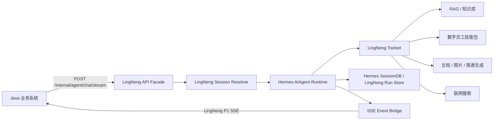

# LingNeng Hermes Runtime Design

## 1. 背景

当前 LingNengAI Python 服务已经能承接 Java 的对话流、RAG、工具调用、培训入库和生成物返回，但在实际使用中暴露出几个核心问题：

- 对话上下文质量不稳定，依赖 Java 历史消息后，Python 侧无法完整掌控 agent 运行轨迹、工具调用过程和压缩策略。
- 工具调用链路和 Agent runtime 稳定性不如 Hermes，尤其是长对话、工具循环、流式输出、会话恢复和工具事件处理。
- Java 端代码当前无法修改，因此新 runtime 必须兼容现有 Java 调用方式，不能要求 Java 新增 agent session、清空会话通知或新的历史接口协议。

Hermes fork 位于 `/Users/rotas/Documents/work/hailun/demos/lingneng-hermes`。本设计选择以 Hermes 为底座，迁入 LingNeng 业务能力，而不是在 LingNengAI 内部只抽取 Hermes 的部分核心代码。原因是 Hermes 的稳定性来自完整 runtime：会话库、agent loop、工具编排、流式回调、插件、配置、profile 和测试约束共同工作。只迁移局部核心，容易失去 Hermes 已经验证过的系统运作方式。

## 2. 目标

本阶段目标是构建一个可替代当前 LingNengAI 对话入口的 `LingNeng Hermes Runtime`：

1. 保留 Hermes 原有 CLI、Gateway、插件、渠道和工具体系，不在第一阶段删除无关功能。
2. 在 Hermes fork 中新增 LingNeng Java 兼容 API facade，接收现有 `POST /internal/agent/chat/stream` 请求。
3. Python 侧完全独立维护会话上下文，不再从 Java 拉取历史消息，也不把 Java `history` 当作 Agent 上下文来源。
4. 使用 Java 请求中的 `conversation_id` 作为业务会话标识，并在 Python 内部组合租户、用户和员工维度形成真正的 session key。
5. 将 LingNeng 当前业务能力迁入 Hermes 工具层，包括 RAG、技能读取、文档生成、图片生成、图表生成、联网搜索和附件理解相关能力。
6. 将 Hermes 的流式文本、工具进度、生成物和终态映射成 LingNeng 当前 Java 稳定消费的 SSE 事件合同。
7. 业务跑通后，再进入第二阶段清理 Hermes 中对 LingNeng 无用的渠道、UI、插件或默认工具。

## 3. 非目标

本阶段不做以下事情：

- 不修改 Java 端代码，不要求 Java 改请求字段、改 SSE 消费逻辑或新增会话管理接口。
- 不删除 Hermes 原有渠道、桌面端、TUI、Cron、Kanban、插件目录或默认功能。
- 不直接复刻 LingNengAI 当前 LangGraph ChatGraph。Hermes runtime 是新主干，LingNengAI 只作为业务能力和接口合同参考。
- 不把 Java 历史消息继续作为 Agent 长期上下文来源。
- 不在第一阶段重构培训入库、AIGC MQ 回流和部署体系，除非对话业务工具接入必须依赖它们的最小接口。

## 4. 关键设计决策

### 4.1 以 Hermes 为主工程改造

新 fork `lingneng-hermes` 作为目标代码仓库。LingNengAI 保持为参考实现和接口来源。迁移方向是“业务进入 Hermes”，不是“核心进入 LingNengAI”。

理由：

- Hermes 的 agent loop、toolset、SessionDB、流式回调和插件机制已经形成整体。
- 后续如果要利用 Hermes 的多 Agent、Cron、Kanban、profile、memory 或 toolset 能力，直接在 Hermes 上做扩展成本更低。
- 保留 Hermes 原生态结构，有助于先验证业务效果，再决定哪些功能可以删除。

### 4.2 第一阶段保留 Hermes 无关功能

第一阶段只新增 LingNeng 业务入口和工具集，不删除 Hermes 现有渠道。对 LingNeng API 来说，默认只加载 LingNeng 允许的工具集；其它 Hermes 工具和渠道继续存在，但不暴露给 Java 对话入口。

这可以降低改造风险：如果业务迁移中需要参考 Hermes 原本的 API Server、Gateway、SessionDB 或工具实现，代码还在原位。

### 4.3 Java 与 Python 会话解耦

Python 自己维护 session，不再依赖 Java 历史消息。Java 每次调用仍发送当前 query 和现有 request fields，Python 使用这些字段定位内部会话。

内部 session key：

```text
tenant_id:user_id:employee_id:conversation_id
```

当 `employee_id` 不存在时，使用：

```text
tenant_id:user_id:employee_type:conversation_id
```

当 `conversation_id` 为空时，仅为兼容使用 `session_id` 作为 fallback：

```text
tenant_id:user_id:employee_id:session_id
```

fallback 会记录降级日志，因为它无法表达真实业务 conversation 边界。

### 4.4 Java `history` 的处理方式

Java 请求里的 `history` 不进入 Hermes Agent 的长期上下文。第一阶段处理规则：

- 默认忽略 `history`。
- 可以将 `history` 数量、时间范围和是否存在记录到 debug trace，用于迁移期排查。
- 不将 `history` 混入 Hermes SessionDB，避免 Java 历史质量问题污染 Python 自维护上下文。

### 4.5 `request_id` 作为幂等键

Java 可能因为网络、SSE 断开或调用超时重试同一个请求。Hermes 侧必须用 `request_id` 做幂等控制：

- 同一个 session key 下，如果同一个 `request_id` 已经完成，重复请求返回已知终态或拒绝重复写入，不能再次把用户消息追加进会话。
- 如果同一个 `request_id` 正在运行，重复请求不能启动第二个 Agent loop。
- 幂等记录至少保存 request 状态、run_id、最终 answer、artifacts、错误状态和完成时间。

## 5. 目标架构

### 5.1 运行边界



### 5.2 新增模块职责

建议在 Hermes fork 中新增 `lingneng/` 业务命名空间，避免一开始污染 Hermes 核心文件：

- `lingneng/api/`：Java 兼容 HTTP/SSE API facade。
- `lingneng/schemas/`：LingNeng 请求、员工、附件、SSE event schema。
- `lingneng/session/`：session key 解析、幂等记录、Hermes SessionDB 读写适配。
- `lingneng/events/`：Hermes runtime callback 到 LingNeng SSE event 的桥接。
- `lingneng/tools/`：LingNeng 业务工具注册、工具 schema、工具执行器。
- `lingneng/skills/`：数字员工技能包加载、裁剪和注入策略。
- `lingneng/config/`：Java internal auth、业务工具开关、外部服务地址等配置。

Hermes 原有 `run_agent.py`、`model_tools.py`、`toolsets.py`、`gateway/platforms/api_server.py` 应尽量少改。需要接入时优先通过现有 callback、tool registry、plugin 或 API server mount 扩展；确实需要小改核心时，改动要围绕稳定扩展点，不写 LingNeng 专用硬编码逻辑。

## 6. API Facade 设计

### 6.1 HTTP 入口

新增或挂载：

```text
POST /internal/agent/chat/stream
Content-Type: application/json
Response: text/event-stream
```

请求字段以 LingNengAI 当前 `ChatRequest` 和 `agent-java-interface-contract-p1.md` 为准，关键字段包括：

- `request_id`
- `tenant_id`
- `user_id`
- `session_id`
- `conversation_id`
- `query`
- `employee`
- `system_prompt`
- `skill`
- `history`
- `attachments`
- `options`
- `stream_options`

### 6.2 认证

沿用当前 Java internal 调用模型。Hermes 侧配置独立 internal key，不把密钥写入代码仓库或文档仓库。

认证失败返回非 SSE HTTP 错误；认证成功后，一旦进入 SSE 流，业务异常通过 SSE `error` 事件表达。

### 6.3 SSE 事件合同

Java 稳定消费的 P1 event name 保持不变：

- `run_started`
- `agent_step`
- `route_result`
- `route_suggestion`
- `route_confirm_required`
- `citation_delta`
- `rag_context`
- `artifact_created`
- `answer_delta`
- `final`
- `compliance_block`
- `error`

Hermes 内部事件映射：

| Hermes runtime 信号 | LingNeng SSE |
| --- | --- |
| Agent run 创建 | `run_started` |
| 文本 delta callback | `answer_delta` |
| 工具开始、工具阶段、工具完成 | `agent_step` |
| RAG 命中文档 | `citation_delta` / `rag_context` |
| 生成文件、图片、图表 | `artifact_created` |
| Agent final response | `final` |
| 业务合规拦截 | `compliance_block` |
| runtime 或工具异常 | `error` |

SSE data 继续遵守当前约定：事件类型由 SSE `event:` 行表达，`data` JSON 不要求包含 `event` 字段。heartbeat 使用 comment frame，例如 `: ping`，Java 不应把它当业务事件。

## 7. Session 与历史消息设计

### 7.1 Python 自维护消息

每个 session 保存：

- 用户消息。
- assistant 可见回答。
- tool call 请求和结果。
- RAG citation 和上下文摘要。
- artifact 元信息。
- run 状态和错误。
- 压缩后的摘要消息。

Hermes SessionDB 作为主要持久化层。LingNeng 可新增轻量 run store 表保存 request 幂等、SSE 重放摘要和业务索引字段。

### 7.2 上下文装载策略

收到 Java 请求后：

1. 根据请求字段解析 session key。
2. 使用 session key 查找 Hermes 会话。
3. 将当前 query 追加为本轮用户消息。
4. 将 Hermes SessionDB 中的历史轨迹交给 AIAgent。
5. 由 Hermes 原有压缩机制处理长上下文。
6. 本轮结束后持久化 assistant final、工具结果和生成物。

Java `history` 不参与第 4 步。

### 7.3 员工切换

session key 包含员工维度，因此同一个 `conversation_id` 在不同员工下默认是不同 session。这样可以避免老板助手、运营专员、营销内容员工之间的系统提示、技能包和工具轨迹互相污染。

如果后续产品需要“同一 conversation 跨员工共享摘要”，应作为第二阶段显式能力实现，而不是第一阶段默认混用上下文。

### 7.4 清理策略

由于 Java 无法通知 Python 清空或删除会话，Hermes 侧需要定期清理：

- 默认保留最近 90 天活跃 session。
- 超过 90 天未活跃的 session 可归档；超过 180 天未活跃的归档 session 可删除。
- 幂等 request 记录默认保留 7 天，短于完整 session。
- 清理行为需要记录日志，避免误删后无法排查。

以上天数必须做成配置项，默认值按本节执行。

## 8. 工具与技能迁移设计

### 8.1 LingNeng Toolset

新增 LingNeng 专用 toolset，只暴露业务需要的工具：

- `retrieve_rag`
- `list_skills`
- `search_skills`
- `read_skill`
- `read_skill_resource`
- `document_generation`
- `image_generation`
- `chart_visualization`
- `web_search`
- `read_workspace`
- `write_workspace`
- 附件解析和当前请求附件理解相关工具

默认不向 Java 对话入口暴露 Hermes 高风险通用工具，例如 terminal、任意文件读写、浏览器自动化、代码执行和跨渠道消息发送。

### 8.2 数字员工技能包

LingNeng 当前 employee、base skill、task skill、capability skill 的结构迁入 Hermes 后，采用“受控技能包”策略：

- Java 请求中的 `employee` 决定本轮员工身份。
- 员工基础提示和允许工具由 LingNeng skill loader 生成。
- 任务技能按 query、员工职责和显式 skill 字段选择。
- skill 内容采用 progressive disclosure，不一次性把所有技能全文塞入系统提示。
- `script_policy` 保持 metadata-only 或等价限制，避免技能包直接引导执行未授权脚本。

### 8.3 外部服务边界

业务工具可以继续调用 LingNengAI 现有外部依赖或 Java 内部接口，包括 RAG、文件转换、AIGC、MinIO、搜索服务等。第一阶段不强制把这些底层服务全部迁入 Hermes，只迁移 agent-facing 工具接口和事件返回。

## 9. 错误处理与可观测性

### 9.1 错误事件

进入 SSE 后，错误通过 `error` event 返回。错误 data 至少包含：

- `run_id`
- `request_id`
- `code`
- `message`
- `trace_id`
- `recoverable`

工具失败时，如果 Agent 能继续，应发送 `agent_step` 说明工具失败并让 Agent 继续；如果不能继续，发送 `error` 并关闭流。

### 9.2 日志与 trace

每轮请求日志必须能关联：

- `request_id`
- `run_id`
- `tenant_id`
- `user_id`
- `conversation_id`
- `session_key`
- `employee_id` 或 `employee_type`
- 触发的工具名
- final status

迁移期需要记录 Java `history` 是否存在但不记录完整历史内容，避免噪音和隐私风险。

### 9.3 兼容性验证

需要用当前 LingNengAI 的 Java interface contract 作为兼容性基准。第一阶段验收时，Java 不改代码也能消费 Hermes 新入口的 SSE。

## 10. 分阶段实施范围

### Phase 1: 对话 API 跑通

- 在 Hermes 中新增 LingNeng API facade。
- 完成 request schema、session key、idempotency、SSE bridge。
- 使用 Hermes AIAgent 跑最小对话。
- `answer_delta` 和 `final` 与 Java 当前消费方式兼容。

### Phase 2: 核心业务工具迁移

- 接入 RAG。
- 接入数字员工 skill loader。
- 接入文档、图片、图表生成工具。
- 接入附件解析和当前请求附件上下文。
- 完成工具进度到 `agent_step`、`artifact_created`、`citation_delta` 的映射。

### Phase 3: 会话质量与压缩

- 完成 Python 自维护 session 的长期存储。
- 完成长上下文压缩策略和恢复测试。
- 完成 request 重试幂等和重复 SSE 保护。
- 完成会话清理配置。

### Phase 4: 业务验收与裁剪

- 与现有 Java 联调。
- 对比 LingNengAI 当前输出质量、工具调用稳定性和长对话表现。
- 明确无用 Hermes 渠道和功能清单。
- 在验证通过后再做删除或禁用。

## 11. 验收标准

第一阶段完成时：

- Java 可不改代码请求 `/internal/agent/chat/stream`。
- Hermes 返回 `text/event-stream`。
- 至少支持 `run_started`、`answer_delta`、`final`、`error`。
- 同一 `conversation_id` 的多轮对话由 Python 自己维护上下文。
- Java 请求中的 `history` 不影响 Agent 上下文。
- 同一 `request_id` 重试不会重复追加用户消息。
- 不向 LingNeng API 暴露 Hermes 高风险默认工具。

第二阶段完成时：

- 数字员工能按员工身份加载基础职责和任务技能。
- RAG、生成物和业务工具能通过 Hermes tool loop 被调用。
- 工具过程能映射为 Java 可展示的 `agent_step`。
- 生成物能通过 `artifact_created` 和 `final.artifacts` 返回。

第三阶段完成时：

- 长会话能被 Hermes 自己压缩和恢复。
- session 清理策略可配置。
- 对话 trace 能支持联调排查。

## 12. 风险与控制

| 风险 | 控制方式 |
| --- | --- |
| Hermes API Server 与 LingNeng API facade 边界混乱 | 新增 `lingneng/` 命名空间，优先挂载新路由，少改核心 |
| Java 无法修改导致 session 控制不足 | 使用 `conversation_id` 和组合 session key，补充清理策略 |
| Java `history` 与 Python session 冲突 | 第一阶段明确忽略 `history`，只记录存在性 |
| Hermes 默认工具过宽 | 为 LingNeng API 单独定义 toolset，不继承高风险工具 |
| 业务工具迁移影响范围大 | 分 Phase 迁移，先跑通纯对话，再接工具 |
| SSE 事件不兼容 Java | 以 `agent-java-interface-contract-p1.md` 为基准写 contract test |
| request 重试导致重复上下文 | `request_id` 幂等表和 run 状态机 |

## 13. 后续计划入口

本规格通过后，下一步应编写 implementation plan。计划需要按可提交任务拆分，建议至少包含：

1. LingNeng API facade 和 schema。
2. session key 与幂等 run store。
3. Hermes AIAgent 适配器。
4. SSE event bridge。
5. LingNeng toolset 骨架。
6. RAG 与 skill loader 最小迁移。
7. Java contract tests 和手工联调脚本。
