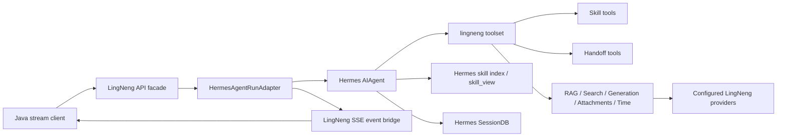

# LingNeng Business Capability Hermes Migration Spec

## Status

Drafted on `dev` after the initial LingNeng-Hermes runtime phases were
implemented and after re-checking the current Hermes fork against the latest
LingNengAI `dev` reference code.

This spec is the durable scope definition for the next migration stage:

```text
LingNeng business behavior -> Hermes-native skills, tools, events, providers
```

It is not a deployment spec and it is not a rewrite of the already implemented
Java-compatible runtime foundation.

## Required Context Reloaded

The following durable migration files were reloaded before writing this spec:

- `LINGNENG_MIGRATION_CONTEXT.md`
- `docs/lingneng-migration/specs/2026-06-06-lingneng-hermes-runtime-design.md`
- `docs/lingneng-migration/plans/2026-06-06-lingneng-hermes-runtime-implementation-plan.md`

The following existing phase specs were checked to avoid duplicating completed
work:

- `docs/lingneng-migration/specs/2026-06-06-phase-3-lingneng-toolset-security-spec.md`
- `docs/lingneng-migration/specs/2026-06-06-phase-4-rag-skill-minimum-spec.md`
- `docs/lingneng-migration/specs/2026-06-06-phase-5-artifacts-attachments-generation-spec.md`

## Reference Implementation Inspected

Use the sibling LingNengAI checkout only as a read-only business reference:

```text
/Users/rotas/Documents/work/hailun/LingNengAI
```

Reference areas inspected for this spec:

- `app/skills/**/SKILL.md`
- `app/domain/skills/*`
- `app/domain/tools/*`
- `app/domain/routing/*`
- `app/graphs/chat/nodes/entry_decision.py`
- `app/graphs/chat/nodes/route_employee.py`
- `app/domain/rag/*`
- `app/domain/training/*`
- `app/graphs/training/*`
- `app/domain/chat_attachments/*`
- `app/domain/prompt/*`
- `app/domain/time_context/*`
- `app/schemas/http/chat_events.py`
- `app/config/settings.py`
- `app/application/provider_factory.py`

Current Hermes-side modules inspected:

- `lingneng/runtime/hermes_adapter.py`
- `lingneng/schemas/chat_events.py`
- `lingneng/events/bridge.py`
- `lingneng/skills/loader.py`
- `lingneng/tools/toolset.py`
- `lingneng/tools/stubs.py`
- `lingneng/tools/rag.py`
- `lingneng/tools/web_search.py`
- `lingneng/tools/attachments.py`
- `lingneng/config/settings.py`
- `toolsets.py`
- `tools/skills_tool.py`
- `agent/skill_utils.py`
- `agent/prompt_builder.py`

## Goal

Complete the migration of LingNeng business capabilities into this Hermes fork
without bringing back the old LingNengAI graph/runtime shape.

The result should let the Java stream endpoint use real LingNeng business
behavior through Hermes primitives:

- Hermes SessionDB remains the conversation history source.
- Hermes `AIAgent` remains the only chat agent loop.
- Hermes registry/toolset remains the tool exposure mechanism.
- Hermes skill discovery/progressive disclosure becomes the skill mechanism.
- LingNeng-specific SSE events remain Java-compatible.
- LingNeng business providers are connected through explicit provider
  boundaries, not direct imports from the old project.

## Current Baseline

### Already Done And Not A Migration Item

These foundations are already Hermes-native and must not be re-planned as old
LingNengAI migrations:

- Java-compatible `POST /internal/agent/chat/stream` facade.
- Basic `text/event-stream` encoding and heartbeat behavior.
- Internal auth and ready/health endpoints.
- `request_id` idempotency and completed-run replay.
- Session key resolution from tenant, user, employee, and conversation id.
- Hermes SessionDB conversation history loading and persistence.
- Java `history` counting/tracing without merging it into Hermes context.
- Dedicated `lingneng` toolset boundary.
- Exclusion of high-risk Hermes default tools from Java API calls.
- Basic `agent_step`, `citation_delta`, `rag_context`,
  `artifact_created`, `answer_delta`, `final`, and `error` event support.
- Minimal Docker deployment assets and server deployment proof.

### Current Gaps

The current runtime has the right shell, but it does not yet contain the full
LingNeng business implementation:

- `list_skills`, `search_skills`, `read_skill`,
  `read_skill_resource`, `read_workspace`, and `write_workspace` are still
  `NOT_CONFIGURED` stubs.
- `retrieve_rag` has a provider boundary and HTTP adapter, but not a complete
  in-Hermes retrieval/training stack.
- `document_generation`, `image_generation`, `chart_visualization`, and
  `web_search` have provider protocols and safe result envelopes, but real
  LingNeng providers are not wired for production behavior.
- Attachment processing has validation, host/size limits, provider protocol,
  and prompt injection point, but no real parser/OCR/vision/document provider.
- Route event names are reserved, but `RouteResultEvent`,
  `RouteSuggestionEvent`, `RouteConfirmRequiredEvent`, and
  `ComplianceBlockEvent` are not implemented on the Hermes side.
- LingNeng skill content still lives in the old project and is only loadable
  through an interim `LINGNENG_SKILL_ROOTS` loader path.
- Time context and festival-calendar behavior from old LingNengAI is not
  represented in the Hermes LingNeng toolset or prompt context.
- Training ingestion, vector indexing, worker lifecycle, and cancellation are
  not migrated.

## Scope

This spec covers the remaining business migration work after the initial
runtime foundation:

1. Convert LingNeng employee, task, capability, and infrastructure skills into
   Hermes-native skill packages.
2. Replace skill stubs with Hermes-native skill listing, searching, reading,
   and resource reading tools.
3. Add a Hermes-native employee boundary and handoff mechanism that uses
   skills and tools instead of the old pre-agent router graph.
4. Add Java-compatible route and compliance SSE payload models and event bridge
   behavior.
5. Wire real LingNeng business providers for web search, document generation,
   image generation, chart visualization, artifacts, and attachment
   understanding.
6. Add deterministic time context and festival-calendar support as either a
   safe LingNeng tool or bounded request context.
7. Keep RAG query usable through a configured provider, with a clear boundary
   between short-term old-service integration and later full ingestion
   migration.
8. Define the later training/RAG ingestion migration boundary without pulling
   it into the immediate chat-runtime implementation.
9. Extend tests and comparison fixtures so regressions are measured through the
   Java-facing SSE contract and public tool outputs.

## Non-Goals

This spec does not:

- Modify Java code or require Java to change the stream endpoint contract.
- Replace Hermes `AIAgent` with the old LingNengAI LangGraph chat graph.
- Import old `app.*` modules from `/Users/rotas/Documents/work/hailun/LingNengAI`
  at runtime.
- Reintroduce Java conversation history as the Python agent context source.
- Rebuild the old `entry_decision`, `request_plan`, `history_policy`, or
  `light_answer` nodes as a second orchestration layer.
- Add a second tool execution framework beside Hermes registry/toolsets.
- Expose terminal, arbitrary filesystem, browser automation, code execution,
  cross-channel messaging, Kanban, dashboard, or personal-agent tools to the
  Java API.
- Turn old fake providers into production behavior.
- Add CI/CD automation. GitHub Actions and server deployment are separate
  deployment work.
- Force full RAG training ingestion into the immediate chat-runtime migration.
  Training is specified as a later, independent migration stage.

## Accepted Decisions

1. **History/session is complete.** The old LingNengAI conversation history
   fetcher and history policy are not migrated. Hermes SessionDB stays the
   single chat history source for this runtime.
2. **Skills become Hermes-native.** LingNeng skill content is migrated, but
   old `SkillMiddleware` is not. The final mechanism uses Hermes skill
   discovery and progressive disclosure.
3. **Business tools become Hermes tools.** Each LingNeng capability is exposed
   through `tools.registry.registry.register(...)` or a context override under
   the dedicated `lingneng` toolset.
4. **Provider boundaries stay explicit.** Real services are wired through
   provider protocols and environment/config settings. Tests use injected fake
   providers, not live services.
5. **Routing is agent-native handoff, not a new router graph.** The model runs
   as the current employee and uses skill boundaries plus handoff tools to
   suggest or request a transfer when the current employee is not the right
   owner.
6. **Route tools are contract emitters and validators.** They validate employee
   ids, candidates, confidence, and public reason text, then allow the event
   bridge to emit Java-compatible route events. They do not own a separate
   LangGraph-style pre-routing pipeline.
7. **RAG query and RAG training are separate.** Short-term chat can call an
   external RAG endpoint, including the old LingNengAI service if configured.
   Full training ingestion migration is later work.
8. **Production must not rely on sibling checkout paths.** The old
   `/LingNengAI/app/skills` path may be used for local comparison only. Runtime
   skills must be copied/provisioned into this repository, `$HERMES_HOME/skills`,
   or configured Hermes `skills.external_dirs` during deployment.
9. **No fake behavior in Hermes mode.** `LINGNENG_AGENT_MODE=hermes` should
   surface `NOT_CONFIGURED` or safe degradation when a real provider is missing,
   not silently use old fake providers.
10. **Compliance is deterministic until a provider is explicitly added.** The
    immediate migration should implement the Java payload model and a safe
    deterministic provider boundary; it should not add another hidden LLM
    classifier without a dedicated spec.

## Migration Inventory

| Area | Current Hermes status | LingNengAI reference | Migration decision |
| --- | --- | --- | --- |
| API/SSE/session/idempotency | Implemented | `chat_stream.py`, `chat_events.py` | Keep Hermes implementation |
| Java `history` | Accepted but ignored for context | `conversation_history_service.py`, `history_policy.py` | Do not migrate old history path |
| Employee base skills | Interim loader | `app/skills/employees/*` | Convert to Hermes-native skill packages |
| Task/capability/infrastructure skills | Not fully exposed | `app/skills/tasks`, `capabilities`, `infrastructure` | Convert and expose through Hermes skill tools |
| Skill list/search/read/resource tools | Stubs | `domain/skills/middleware.py` | Rebuild using Hermes skill catalog |
| RAG query | Provider boundary exists | `domain/rag/retrieval_service.py` | Wire provider first; full retrieval later |
| RAG training ingestion | Not present | `domain/rag/ingestion_service.py`, `graphs/training` | Later independent phase |
| Web search | Provider boundary exists | `domain/tools/web_search.py`, Bocha provider | Wire real provider, keep safe result shape |
| Document generation | Provider boundary exists | `domain/tools/document_generation.py` | Wire Java file/PDF provider or equivalent |
| Image generation | Provider boundary exists | `providers/image_generation/aigc_http.py` | Wire AIGC HTTP provider |
| Chart visualization | Provider boundary exists | `domain/tools/chart_visualization.py` | Wire provider and artifact output |
| Artifact storage/result | Public model exists | `domain/artifacts/artifact_service.py`, object storage | Wire storage/upload boundary |
| Attachments | Safety shell exists | `domain/chat_attachments/*` | Wire parser/OCR/vision provider |
| Time context | Missing | `domain/time_context/*` | Add deterministic tool/context |
| Employee routing/handoff | Event names only | `domain/routing/*`, `route_employee.py`, `entry_decision.py` | Implement skill-driven handoff tools/events |
| Compliance block | Event name only | `ComplianceBlockEvent` in old schema | Add model and provider boundary |
| Workspace read/write | Stubs | `agent_harness/workspace.py` | Keep disabled unless product requires it |
| Tool admission | Hermes toolset isolation exists | `domain/tools/admission.py` | Migrate deterministic guardrails only |
| Smalltalk/light answer | Not separate | `light_llm_answer.py`, smalltalk nodes | Let Hermes answer through employee skills |
| Request planning | Not separate | `request_plan.py` | Do not migrate as an orchestration layer |

## Target Architecture



The LingNeng runtime remains an adapter layer around Hermes. New business code
should live under `lingneng/` or standard Hermes skill directories, with
minimal edits to Hermes core.

## Skill Migration Design

### Canonical Skill Location

LingNeng skill packages should become part of the Hermes runtime instead of
living only in the old project. The preferred production locations are:

- Repo-bundled skills under a LingNeng namespace such as
  `skills/lingneng/tasks/marketing-copy-generation`, when the skills should
  ship with this fork.
- `$HERMES_HOME/skills/lingneng/tasks/marketing-copy-generation`, when
  deployment provisions them as runtime data.
- Hermes `skills.external_dirs`, when an operator wants to mount a shared
  read-only skill directory.

`LINGNENG_SKILL_ROOTS` may remain as a compatibility bridge for the Java API
adapter, but it should not be the only long-term mechanism.

### Skill Groups To Migrate

Employee base skills:

- `employee-boss-assistant`
- `employee-operation-specialist`
- `employee-product-combo-advisor`
- `employee-marketing-planner`
- `employee-marketing-content-creator`
- `employee-member-operator`

Task skills:

- `knowledge-base-answer`
- `marketing-copy-generation`
- `member-repurchase-campaign`
- `restaurant-campaign-planning`
- `restaurant-channel-growth-strategy`
- `restaurant-combo-pricing-strategy`
- `restaurant-menu-engineering`
- `restaurant-strategy-planning`
- `store-operation-analysis`
- `training-summary-report`

Capability skills:

- `document-generation`
- `image-generation`
- `chart-visualization`
- `report-formatting`

Infrastructure contract skills:

- `artifact-output-contract`
- `business-answer-contract`
- `rag-citation-contract`
- `tool-observation-contract`

### Metadata Rules

Migrated skills must preserve LingNeng business metadata under
`metadata.lingneng`, including at least:

- `kind`
- `employee_type` for employee base skills
- `display_name`
- `target_employee_types`
- `recommended_task_skills`
- `recommended_capabilities`
- `tools`
- `supporting_skills`
- `user_visible`
- `script_policy`

Additional Hermes-native metadata may be added under `metadata.hermes` to help
Hermes discover the skill:

- `tags`
- `requires_tools`
- `fallback_for_toolsets`
- `related_skills`

`script_policy` must remain `metadata_only` for LingNeng Java API usage. Skills
may contain references/templates/examples/assets, but the agent should read
them only through progressive disclosure, not by blindly injecting all files.

### Skill Prompt Behavior

For each Java request, the runtime should provide the model with:

1. The current employee base skill boundary.
2. A short list of recommended task/capability skills.
3. Guidance to call `list_skills`, `search_skills`, `read_skill`, or
   `read_skill_resource` when deeper task instructions are needed.
4. Clear handoff guidance: if the user request belongs to another employee,
   call the handoff tool rather than trying to fully solve it as the wrong
   employee.

The runtime must not trust or inject `request.skill.inline` as system
instructions. It may use a matching `skill.skill_id` only when the id resolves
to a configured, validated skill package.

## Skill Tool Design

Replace these stubs with real Hermes-native handlers:

- `list_skills`
- `search_skills`
- `read_skill`
- `read_skill_resource`

The handlers should use Hermes skill discovery where possible and LingNeng
metadata where required.

Public outputs must be stable JSON and must not include raw local absolute
paths, secrets, unbounded file contents, hidden inactive skills, or resources
outside allowed skill package directories.

### `list_skills`

Input:

- optional `employee_type`
- optional `kind`
- optional `limit`

Output:

- package name
- description
- kind
- display name
- employee type or target employee types
- recommended tools/capabilities
- visible tags

### `search_skills`

Input:

- `query`
- optional `employee_type`
- optional `kind`
- optional `limit`

Search should be deterministic and explainable enough for tests. It may use
metadata, names, descriptions, triggers, headings, and bounded body excerpts.
It should not call an LLM.

### `read_skill`

Input:

- `skill_id`

Output:

- main `SKILL.md` content within configured limits
- metadata
- section summaries when the full body is truncated
- resource manifest

### `read_skill_resource`

Input:

- `skill_id`
- `resource_id` or relative resource path

Allowed resource directories:

- `references`
- `templates`
- `examples`
- `assets`

The handler must reject path traversal, symlinks escaping the package, absolute
paths, hidden files, and oversized files.

## Tool Provider Migration Design

### Common Tool Result Envelope

All real LingNeng tool handlers should return a JSON string whose decoded object
conforms to this public envelope:

```text
success: bool
tool_name: str
status: "succeeded" | "failed" | "skipped"
summary: str
safe_output: dict
artifacts: list[Artifact]
metadata: dict
code: str | null
message: str | null
```

The envelope must not contain:

- API keys
- bearer tokens
- passwords
- Java internal keys
- signed upload credentials
- raw provider exceptions
- Python tracebacks
- local absolute paths
- raw request payloads
- Java history content
- unbounded attachment or document text

### Web Search

Current Hermes status: provider boundary exists in `lingneng/tools/web_search.py`.

Migration requirement:

- Add a real LingNeng provider implementation for the configured web search
  service, starting with the old LingNengAI Bocha-compatible contract.
- Keep `web_search` fail-closed to the LingNeng context override so non-LingNeng
  Hermes surfaces are not affected.
- Normalize result sources to public fields only:
  `id`, `title`, `url`, `website`, `date`, `snippet`.
- Reject invalid schemes, credentials in URLs, control characters, local/private
  URLs when not explicitly allowed, and malformed authorities.
- Clamp `top_k` and sanitize recency/site filters.

### Document Generation

Current Hermes status: provider boundary exists in
`lingneng/tools/document_generation.py`.

Migration requirement:

- Wire a real document provider compatible with LingNeng business behavior.
- Preserve the old requirement that the tool receives a complete document body,
  not just a prompt asking the provider to write the body.
- Produce Java-compatible document artifacts.
- Support markdown-to-PDF conversion through a configured Java file/PDF service
  or an equivalent provider boundary.
- Keep generated source content bounded in public tool output.

### Image Generation

Current Hermes status: provider boundary exists in
`lingneng/tools/image_generation.py`.

Migration requirement:

- Wire a real AIGC image provider through env/config.
- Clamp count, size, quality, and timeout.
- Return partial success with available artifacts when the provider supports it.
- Do not expose raw prompts beyond configured public-output limits.

### Chart Visualization

Current Hermes status: provider boundary exists in
`lingneng/tools/chart_visualization.py`.

Migration requirement:

- Wire a chart provider or reuse the image-generation provider with a chart
  prompt boundary.
- Preserve `artifact_type == "image"` and `source == "chart_visualization"`.
- Validate and bound input data summaries.
- Avoid generating charts from raw unbounded table/file contents without the
  attachment/document parser boundary.

### Artifact Storage

Current Hermes status: public artifact validation exists.

Migration requirement:

- Add a real storage/upload provider boundary.
- Support object keys and public URLs compatible with Java UI expectations.
- Validate public URLs against allow-lists when external artifact URLs are
  returned by providers.
- Persist final artifacts through `LingNengRunStore` for idempotent replay.

### Time Context

Current Hermes status: not implemented as a LingNeng tool.

Migration requirement:

- Add a deterministic `time_context` tool or bounded request context provider.
- Include timezone, region, current date/time, relevant holidays/festivals, and
  business calendar hints.
- Use the old `festival_calendar.yaml` behavior as business reference.
- Avoid adding live network dependencies.
- Keep current date/time generated at runtime, not hardcoded in skill content.

### Workspace Read/Write

Current Hermes status: stubs.

Migration requirement:

- Keep stubs unless a concrete LingNeng business workflow requires workspace
  persistence.
- If enabled later, implement a controlled LingNeng workspace provider with
  tenant/session scoping, path allow-listing, size limits, and no access to
  arbitrary host filesystem paths.

## Attachment Understanding Design

Current Hermes status: safety shell and provider protocol exist in
`lingneng/tools/attachments.py`.

Migration requirement:

- Wire a real attachment processing provider adapted from LingNengAI business
  behavior.
- Support document text extraction, CSV/Excel handling, image OCR/vision
  summaries, chunk selection, and direct current-request context generation.
- Process only `request.attachments` from the current request.
- Never persist raw attachment text into memory or SessionDB by default.
- Never merge Java `history` attachment text into the current request.
- Enforce allowed hosts, file count, total bytes, per-file bytes, image bytes,
  timeouts, and context length.
- Sanitize URLs, metadata, and body text before prompt injection.
- Emit public `agent_step` progress for started, completed, skipped, failed, and
  timeout states.

If direct attachment answers are still needed, they should be expressed through
Hermes prompt/tool behavior, not by reintroducing the old graph node as a
parallel answer path.

## RAG Design

### Short-Term Chat Query Integration

Current Hermes status: `retrieve_rag` has a request context, provider protocol,
HTTP provider, result sanitization, citations, and `rag_context` event bridge.

Migration requirement:

- Keep `retrieve_rag` as a normal Hermes tool.
- Configure it to call an external RAG service when `LINGNENG_RAG_ENDPOINT` is
  set.
- It may call the old LingNengAI RAG API in dev/test while training still lives
  in the old project.
- Preserve Java-compatible citations and `rag_context` events.
- Keep provider errors sanitized and non-fatal to the whole stream unless the
  model cannot answer without retrieved knowledge.

### Full Retrieval Migration

Full in-Hermes retrieval is a later phase. It includes:

- query planning
- dense/vector search
- BM25 or lexical search
- RRF fusion
- reranking
- relevance gate
- context building
- citation building
- vector store provider
- embedding provider
- observability for retrieval quality

This should not block skill/tool/routing migration.

### Training Ingestion Migration

Training is explicitly out of the immediate chat-runtime scope.

When migrated later, it needs a dedicated spec and plan for:

- Java or MQ task intake
- task validation
- file download
- office/PDF conversion
- parsing and layout-aware chunking
- image understanding
- cleaning
- scope filtering
- embedding
- vector-store indexing
- activation/finalization
- cancellation
- runtime state store
- summary generation
- object storage
- retry and rollback

Until that phase, the recommended short-term model is:

```text
old LingNengAI owns training and indexing
Hermes retrieve_rag calls the configured old-service query endpoint
```

## Employee Boundary And Handoff Routing Design

### Principle

Do not add a second pre-agent router that decides every request before Hermes
runs. The current employee's Hermes agent should receive clear skill boundaries
and decide whether to answer, ask a clarification, or call a handoff tool.

This keeps the runtime aligned with Hermes:

- One agent loop.
- One tool system.
- Skills describe employee boundaries.
- Tools expose public business actions.
- Events translate tool outcomes for Java.

### Handoff Tools

Add LingNeng handoff tools under the dedicated toolset:

- `suggest_employee_handoff`
- `request_employee_handoff_confirmation`

Optional later tool if Java/UI needs explicit current route reporting:

- `record_current_employee_route`

These tools validate and emit public route intent. They do not call another
LLM router by default.

### `suggest_employee_handoff`

Use when the current employee is clearly not the best owner and there is one
clear target employee.

Input:

- `target_employee_type`
- `reason`
- `reply`
- optional `confidence`

Output:

- stable tool envelope
- route payload with `current_employee_type`, `target_employee_type`,
  `confidence`, `reason`, `reply`

Event bridge:

- emits `route_suggestion`
- emits a terminal `final` with `status == "blocked"` and `answer == reply`
- does not continue solving the wrong employee's task in full after the
  handoff suggestion is emitted

### `request_employee_handoff_confirmation`

Use when the request is ambiguous between two to four employees or needs user
confirmation before switching.

Input:

- `query`
- `candidates`
- `reply`

Candidate fields:

- `employee_type`
- `confidence`
- `label`
- `reason`

Event bridge:

- emits `route_confirm_required`
- persists a bounded pending-confirmation record keyed by session/request
- emits a terminal `final` with `status == "blocked"` and `answer == reply`
- waits for the user/Java side to send a later confirmation turn instead of
  selecting one candidate silently

### Route Event Payloads

Hermes must add Pydantic models matching the old Java-facing fields:

```text
RouteResultEvent:
  target_employee_type
  confidence
  need_confirm
  is_current_employee

RouteSuggestionEvent:
  current_employee_type
  target_employee_type
  confidence
  reason
  reply

RouteCandidate:
  employee_type
  confidence
  label
  reason

RouteConfirmRequiredEvent:
  query
  candidates
  reply
```

The SSE `event:` line carries the event name; event JSON must not require an
embedded `event` field, consistent with current Hermes-side SSE encoding.

### Pending Confirmation

If confirmation follow-up is required, store only bounded public data:

- current employee type
- candidate employee types
- original query excerpt
- reply text
- expiry time
- run id/request id

Do not store raw prompts, full history, secrets, or attachment contents.

The first implementation stores pending confirmations in SQLite alongside the
LingNeng run/session store. Redis can be added later only if deployment needs
multi-process shared state.

## Compliance Block Design

Hermes must add `ComplianceBlockEvent`:

```text
ComplianceBlockEvent:
  risk_level: str
  risk_categories: list[str]
  reply: str
```

Immediate behavior:

- Add the model and SSE bridge support.
- Add a deterministic provider boundary for future business compliance checks.
- If the provider returns a block decision, emit `compliance_block` and a
  terminal `final` with status `blocked`.
- If no provider is configured, do not block by default.

Do not add an LLM compliance classifier in this phase without a separate spec.

## Prompt And Context Design

Current Hermes behavior builds a system message from Java `system_prompt` plus
LingNeng skill fragments, then adds ephemeral attachment/RAG guidance.

Migration requirement:

- Keep Hermes prompt assembly as the host mechanism.
- Add a LingNeng prompt context builder only for business sections that must be
  consistently formatted.
- Label context by trust level:
  - trusted: repository/deployed skills, deterministic time context, validated
    config
  - request-scoped untrusted: user query, attachments, Java runtime context
  - tool-derived public observations: RAG/search/artifact summaries
- Do not blindly copy the old prompt builder or prompt compiler.
- Do not inject Java `history` into prompt context.
- Keep prompt sections bounded and testable.

Old `request_plan`, `entry_decision`, and `light_answer` behaviors should be
absorbed into skill guidance and normal Hermes agent behavior unless a later
business test proves a deterministic pre-step is required.

## Tool Guardrail Design

Hermes already provides the main admission boundary by exposing only the
dedicated `lingneng` toolset to Java API calls.

Additional LingNeng guardrails to migrate:

- schema validation for each tool input
- explicit-intent checks for artifact-producing tools
- max calls per run for expensive artifact tools
- duplicate artifact generation guard
- per-tool timeout settings
- safe failure envelopes
- public metadata allow-lists

Do not migrate the old LLM-based tool admission classifier as a separate
decision layer in the immediate plan. If needed later, it must be specified as
a provider with deterministic fallback and test fixtures.

## Observability And Regression Design

Extend current LingNeng observability with sanitized summaries for:

- selected skills
- skills read by tools
- handoff route decisions
- compliance blocks
- RAG provider status
- web search source count
- generated artifact count
- attachment processed/selected/failed counts
- time context scope
- tool degradation codes

Regression fixtures should verify:

- SSE event order
- final status
- final citations/artifacts
- public route payloads
- public compliance payloads
- tool result envelopes
- no raw secrets/tracebacks/local paths in public events

Tests must not require live LLM, Milvus, Redis, MinIO, Bocha, AIGC, Java file
service, or the old LingNengAI service. Provider integration tests can be
separate and explicitly skipped unless configured.

## Implementation Order

The next implementation work should follow the project rule:

```text
phase spec -> phase plan -> subagent-driven execution
```

Recommended phase order for this business migration:

### Phase 9: Hermes-Native Skill Catalog And Skill Tools

Goal:

- Move LingNeng skill packages into Hermes-discoverable locations.
- Replace skill stubs with real `list/search/read/resource` handlers.
- Update prompts so the agent uses skill tools through progressive disclosure.

Why first:

- Routing depends on employee boundaries.
- Tool usage depends on capability/task skill guidance.
- This phase removes the largest current `NOT_CONFIGURED` surface.

### Phase 10: Employee Handoff Routing And Route Events

Goal:

- Add handoff tools.
- Add route event models.
- Emit `route_suggestion` and `route_confirm_required`.
- Persist pending confirmation data.

Why second:

- The handoff logic should use the migrated skill metadata rather than a copied
  old router.

### Phase 11: Time Context And Prompt Context Hardening

Goal:

- Add deterministic time/festival context.
- Formalize trusted/untrusted prompt sections.
- Add prompt regression fixtures.

Why here:

- It improves business answers without depending on external providers.

### Phase 12: Real Business Tool Providers

Goal:

- Wire web search, document generation, image generation, chart visualization,
  artifact storage, duplicate guard, and tool limits.

Why after skills/routing:

- The model should know when to use these tools before real paid/side-effect
  providers are enabled.

### Phase 13: Attachment Understanding Provider

Goal:

- Wire real document/image attachment parsing.
- Inject current-request attachment context safely.

Why separate:

- It has its own security and resource limits and can affect every prompt.

### Phase 14: RAG Provider Integration Hardening

Goal:

- Make configured external RAG query production-safe.
- Add provider integration tests behind opt-in flags.
- Keep full training ingestion out of this phase.

Why after tool/provider basics:

- Query can work against the old project while training remains there.

### Phase 15: Training/RAG Ingestion Migration

Goal:

- Move old LingNengAI training and indexing into Hermes if the product decision
  is to retire the old training service.

Why last:

- It is a worker/storage/indexing system, not required to make Hermes chat
  use real business behavior in the short term.

## User Confirmations Before The Phase 9 Plan

The following assumptions are locked for the Phase 9 plan unless the user
changes them:

1. Canonical LingNeng skill packages should be copied/provisioned into this
   Hermes runtime, not kept only in the old sibling LingNengAI checkout.
2. The first executable phase is Phase 9: Hermes-native skill catalog and skill
   tools.
3. The old `SkillMiddleware` is reference material only and will not be
   imported.
4. Route/handoff implementation waits until after Phase 9 skill migration.
5. RAG training ingestion remains in the old project for now.
6. Workspace read/write remains stubbed unless a concrete product workflow
   requires it.
7. CI/CD is not included in this business migration plan.

If any assumption changes, update this spec before writing the Phase 9 plan.

## Test Strategy

Each phase plan must include focused tests and avoid live dependencies by
default.

Minimum test categories:

- skill package discovery and metadata validation
- skill list/search/read/resource tool outputs
- path traversal and oversized resource rejection
- prompt context construction
- handoff tool schemas and validation
- route/compliance event schemas
- route event bridge order
- pending confirmation storage and expiry
- provider-not-configured safe degradation
- web search normalization
- artifact validation and replay
- attachment host/size/timeout handling
- time context determinism with frozen clock
- no secret/traceback/raw payload leakage in SSE or tool JSON
- Java-compatible SSE contract fixtures

Recommended verification command pattern:

```bash
uv run --extra dev python -m pytest tests/lingneng -q
```

Phase plans should narrow the command to touched areas first and run the broader
LingNeng suite before commit.

## Acceptance Criteria

This migration stage is complete when:

1. LingNeng employee/task/capability/infrastructure skills are available through
   Hermes-native skill discovery or a documented deployment-provisioned skill
   directory.
2. `list_skills`, `search_skills`, `read_skill`, and
   `read_skill_resource` return real bounded skill data instead of stubs.
3. The current employee can answer within its boundary using migrated skills.
4. The current employee can emit Java-compatible handoff suggestions or
   confirmation requests through Hermes tools/events.
5. Route and compliance Pydantic models exist and are covered by tests.
6. Web search, document generation, image generation, chart visualization, and
   artifact storage use real provider boundaries or explicit safe degradation.
7. Attachment understanding can inject bounded current-request context when a
   provider is configured and degrades safely when not configured.
8. Time context is available to the agent without live network dependencies.
9. RAG query can use a configured external endpoint with sanitized citations and
   context events.
10. Java-facing SSE events and final payloads remain compatible with the current
    LingNeng P1 contract.
11. No old LingNengAI runtime modules are imported by this Hermes fork at
    runtime.
12. Tests prove that Java `history` still does not become Hermes conversation
    context.
