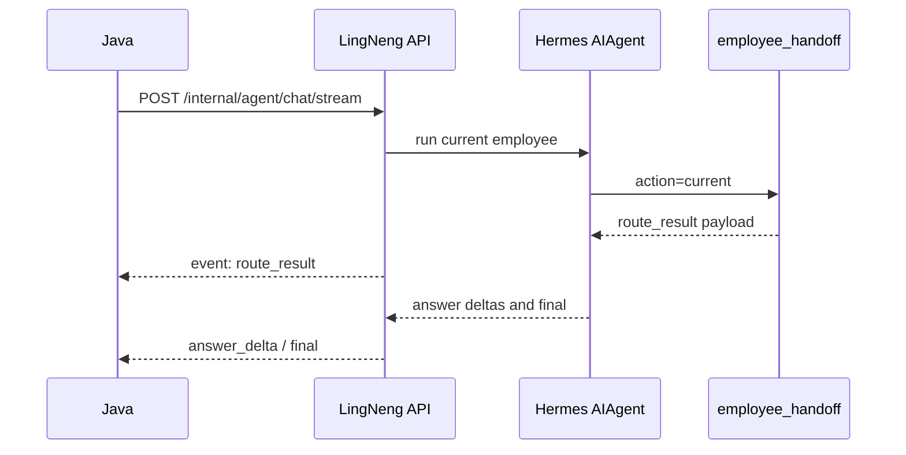
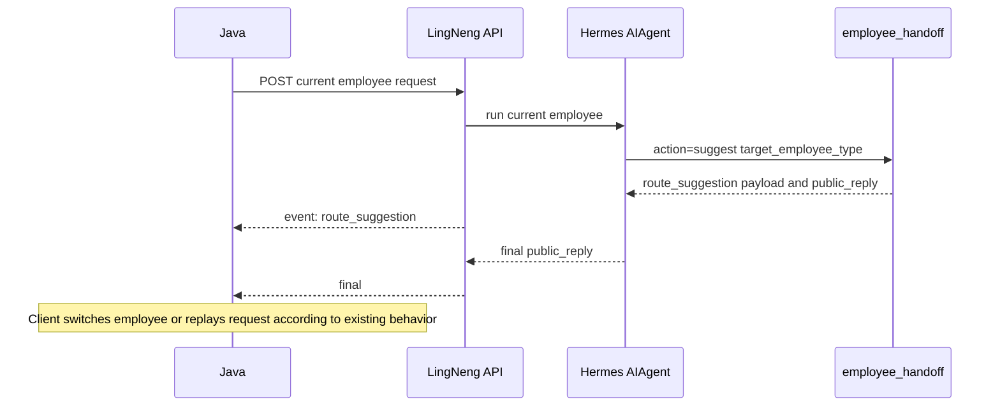
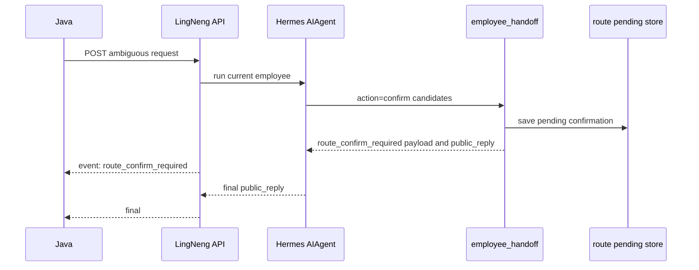

# Phase 10 Agent-Native Employee Handoff Spec

## Status

Drafted on `dev` after Phase 9 completed the Hermes-native LingNeng skill
catalog and skill tools.

This phase implements the first LingNeng business behavior that depends on the
Phase 9 skill catalog:

```text
current employee agent -> validated handoff decision -> Java-compatible route events
```

It is not a return to the old LingNengAI LangGraph routing pipeline.

## Required Context Reloaded

Reloaded before writing this spec:

- `LINGNENG_MIGRATION_CONTEXT.md`
- `docs/lingneng-migration/specs/2026-06-06-lingneng-hermes-runtime-design.md`
- `docs/lingneng-migration/plans/2026-06-06-lingneng-hermes-runtime-implementation-plan.md`
- `docs/lingneng-migration/specs/2026-06-11-lingneng-business-capability-hermes-migration-spec.md`
- `docs/lingneng-migration/specs/2026-06-11-phase-9-hermes-native-skill-catalog-spec.md`

Current Hermes-side modules inspected:

- `lingneng/runtime/hermes_adapter.py`
- `lingneng/schemas/chat_request.py`
- `lingneng/schemas/chat_events.py`
- `lingneng/events/bridge.py`
- `lingneng/skills/catalog.py`
- `lingneng/skills/loader.py`
- `lingneng/tools/stubs.py`
- `lingneng/tools/toolset.py`
- `lingneng/config/settings.py`
- `lingneng/session/run_store.py`
- `toolsets.py`
- `tests/lingneng/schemas/test_chat_event_schema.py`
- `tests/lingneng/tools/test_toolset_policy.py`

LingNengAI reference modules inspected:

- `/Users/rotas/Documents/work/hailun/LingNengAI/app/domain/routing/models.py`
- `/Users/rotas/Documents/work/hailun/LingNengAI/app/domain/routing/policy.py`
- `/Users/rotas/Documents/work/hailun/LingNengAI/app/domain/routing/service.py`
- `/Users/rotas/Documents/work/hailun/LingNengAI/app/graphs/chat/nodes/route_employee.py`
- `/Users/rotas/Documents/work/hailun/LingNengAI/app/graphs/chat/nodes/route_clarification.py`
- `/Users/rotas/Documents/work/hailun/LingNengAI/app/schemas/http/chat_events.py`

## Current Baseline

Phase 9 gives Hermes a real LingNeng skill catalog:

- Six employee base skills are bundled in `skills/lingneng/`.
- Task, capability, and infrastructure skills are bundled and validated.
- `list_skills`, `search_skills`, `read_skill`, and
  `read_skill_resource` are real Hermes tools.
- Prompt context includes the current employee skill and recommended skills.
- The toolset is still a strict whitelist with `merge_registry_tools=False`.

Route support is still only partial:

- `ChatStreamRequest.routing.confirmed_employee_type` exists.
- `ChatStreamRequest.routing.confirmation_message_id` exists.
- SSE event names reserve `route_result`, `route_suggestion`,
  `route_confirm_required`, and `compliance_block`.
- Hermes-side route event payload models do not exist yet.
- The event bridge does not extract route events from tool results.
- No LingNeng handoff tool is registered in the `lingneng` toolset.
- No route pending-confirmation store exists.
- The agent prompt does not yet tell the current employee how to hand off work.

## Goal

Implement employee route and jump behavior in the Hermes way:

1. The current employee remains the running `AIAgent`.
2. The agent uses skill boundaries and skill tools to recognize that another
   employee is a better owner.
3. The agent calls a controlled handoff tool instead of relying on a separate
   pre-agent router graph.
4. The handoff tool validates employee types, candidates, confidence, reason,
   and public reply shape.
5. The event bridge emits Java-compatible `route_result`,
   `route_suggestion`, and `route_confirm_required` SSE payloads.
6. Ambiguous handoff choices can be saved as short-lived pending confirmations.
7. If Java sends `routing.confirmed_employee_type`, Hermes records that
   confirmation and emits the corresponding route decision.

## Why This Phase Comes After Phase 9

Handoff must be grounded in the employee and skill catalog, not in duplicated
hardcoded route tables. Phase 9 made these pieces available inside Hermes:

- employee base skill metadata
- display names and employee types
- target employee metadata from skill packages
- skill search and bounded skill reading
- prompt guidance for current employee capabilities

Phase 10 can now add handoff as a thin validation and event layer over that
catalog.

## Scope

Phase 10 includes:

1. Add Hermes-side route payload models matching the old LingNeng P1 public
   event shape.
2. Add a small employee directory derived from the Phase 9 skill catalog, with
   a static fallback for the six known LingNeng employee types.
3. Add a single `employee_handoff` tool under the `lingneng` toolset.
4. Make `employee_handoff` support three actions:
   - `current`
   - `suggest`
   - `confirm`
5. Return a structured, public, bridge-readable result from the handoff tool.
6. Add route event extraction in `lingneng/events/bridge.py`.
7. Wire extracted route events into `HermesAgentRunAdapter` tool-completion
   handling.
8. Add a short-lived route pending-confirmation store for confirm-required
   events.
9. Honor `routing.confirmed_employee_type` and
   `routing.confirmation_message_id` without requiring Java contract changes.
10. Update skill prompt guidance so employees know when and how to call
    `employee_handoff`.
11. Update toolset policy and tests so the new tool is exposed only through the
    LingNeng Java API surface.
12. Add regression tests for schemas, route models, tool validation, bridge
    extraction, adapter event flow, pending confirmation, and prompt guidance.

## Non-Goals

Phase 10 does not:

- Modify Java code or require Java to call a new endpoint.
- Add a new LangGraph pre-routing pipeline.
- Rebuild old `entry_decision`, `request_plan`, `history_policy`,
  `light_answer`, or smalltalk shortcut nodes.
- Run a hidden LLM classifier before Hermes `AIAgent`.
- Automatically re-run the same request under another employee inside Python.
- Change the session key policy.
- Merge sessions across employees.
- Use Java `history` as Agent context.
- Migrate RAG training or RAG ingestion.
- Implement file attachment understanding.
- Wire new generation/search providers.
- Implement `read_workspace` or `write_workspace`.
- Add compliance provider behavior beyond keeping the event schema boundary
  ready for a later phase.
- Add CI/CD or deployment automation.

## Accepted Decisions

1. **Routing is agent-native handoff.** The current employee agent decides
   through prompt, skills, and tool use. There is no separate route graph before
   the agent.
2. **One tool, three actions.** Phase 10 exposes one tool,
   `employee_handoff`, with `current`, `suggest`, and `confirm` actions. This
   avoids rebuilding a router service while still keeping event contracts
   deterministic.
3. **The tool validates, it does not classify.** The tool accepts the agent's
   proposed decision, validates it, normalizes public fields, persists pending
   confirmation when needed, and returns bridge-readable JSON.
4. **Skill catalog is the employee source.** The preferred employee directory
   comes from bundled employee base skills. A static fallback exists only so
   routing stays stable if skill catalog loading degrades.
5. **No same-request employee rerun.** When target employee differs from the
   current employee, Hermes emits `route_suggestion` and a final public reply.
   The client/Java side is still responsible for switching employee and
   replaying or continuing according to its existing behavior.
6. **Confirmed target uses existing request fields.** If
   `routing.confirmed_employee_type` is present, Hermes records the confirmation
   and emits a route decision. If the confirmed target is not the current
   request employee, the result remains a terminal route suggestion that asks
   the client to switch.
7. **Pending confirmation is short lived.** Pending route confirmations are
   stored under tenant, user, conversation, current employee, and request
   identifiers with a default TTL of 10 minutes.
8. **No old runtime imports.** The implementation may compare against
   LingNengAI, but runtime code must not import old `app.*` modules.
9. **Public event payloads stay minimal.** Route SSE `data` does not include an
   `event` field, does not expose prompts, raw model scores, tool args,
   tracebacks, secrets, or provider payloads.
10. **Failure falls back to current employee.** If route tooling is unavailable
    or validation fails, the agent should continue under the current employee or
    return a public validation error. It must not silently fake a route.

## User Confirmations Before Phase 10 Plan

No additional confirmation is required before writing the Phase 10 plan if the
following assumptions remain accepted:

- Phase 10 emits handoff events and final public replies, but does not
  automatically re-run another employee in the same Python request.
- Phase 10 uses one Hermes tool named `employee_handoff`.
- Phase 10 implements deterministic validation and pending-confirmation storage,
  not an LLM classifier provider.
- Compliance remains event-schema-only until a later dedicated phase.

If same-request automatic employee rerun is required, this spec must be revised
before planning because it changes session ownership, idempotency, event order,
and interruption behavior.

## Data Contracts

### Employee Types

Phase 10 keeps the existing `EmployeeType` enum:

- `boss_assistant`
- `operation_specialist`
- `product_combo_advisor`
- `marketing_planner`
- `marketing_content_creator`
- `member_operator`

Any route target or candidate outside this set is rejected.

### Employee Directory Item

The internal employee directory item should contain:

```text
employee_type: EmployeeType
display_name: str
skill_id: str
description: str
positioning: str | None
aliases: list[str]
domains: list[str]
tags: list[str]
recommended_task_skills: list[str]
recommended_capabilities: list[str]
```

The directory is not a Java-facing API. It exists so the tool can validate
targets and build stable labels.

### Route Candidate

The public candidate model mirrors the old LingNengAI event candidate shape:

```text
employee_type: EmployeeType
confidence: float  # 0 <= confidence <= 1
label: str
reason: str
```

Implementation rules:

- `label` is normalized from the employee directory when possible.
- `reason` is required, public, bounded, and sanitized.
- Duplicate employee types are rejected in `confirm` candidates.
- Candidate count for `confirm` is 2 to 4.

### Route Result Event

`route_result` payload:

```text
target_employee_type: EmployeeType
confidence: float
need_confirm: bool
is_current_employee: bool
```

Use cases:

- `current` action emits `route_result` with `need_confirm=false` and
  `is_current_employee=true`.
- Confirmed current employee emits the same shape with confidence `1.0`.

### Route Suggestion Event

`route_suggestion` payload:

```text
current_employee_type: EmployeeType
target_employee_type: EmployeeType
confidence: float
reason: str
reply: str
```

Use cases:

- Current employee concludes another employee is the right owner.
- User explicitly asks to switch to another employee.
- Java sends `routing.confirmed_employee_type` that differs from the current
  request employee.

The reply should be a short public sentence, such as:

```text
这个问题更适合由营销内容创作处理，我为你切换到对应数字员工。
```

### Route Confirm Required Event

`route_confirm_required` payload:

```text
query: str
candidates: list[RouteCandidate]
reply: str
```

Use cases:

- The request is ambiguous between two to four employees.
- The agent needs the user to choose who should handle the task.

The event does not require a new Java field. Internally, Hermes stores a pending
confirmation keyed by request and conversation identifiers.

### Compliance Block Event

`compliance_block` payload is defined in this phase only to close the schema
gap:

```text
risk_level: str
risk_categories: list[str]
reply: str
```

Phase 10 does not add compliance classification or blocking behavior.

## Tool Contract

### Tool Name

```text
employee_handoff
```

### Tool Schema

Inputs:

```text
action: "current" | "suggest" | "confirm"
target_employee_type: EmployeeType | null
confidence: float
reason: str
reply: str | null
candidates: list[RouteCandidate] | null
```

AdditionalProperties must be `false`.

### Action Rules

`current`:

- `target_employee_type` must equal the current request employee.
- `candidates` may be omitted.
- Emits `route_result`.
- Does not persist pending confirmation.
- Non-terminal for business work.

`suggest`:

- `target_employee_type` must differ from the current request employee unless
  this is a confirmed-current case.
- `reply` is required.
- `reason` is required.
- Emits `route_suggestion`.
- Terminal for this request from the product perspective.
- Does not automatically run the target employee.

`confirm`:

- `candidates` must contain 2 to 4 valid employees.
- `target_employee_type` may be omitted or set to the current best candidate.
- `reply` is required and must ask the user to choose.
- Emits `route_confirm_required`.
- Persists pending confirmation when `conversation_id` exists.
- Terminal for this request from the product perspective.

### Tool Result Shape

The tool returns JSON:

```json
{
  "success": true,
  "tool_name": "employee_handoff",
  "route_event_type": "route_suggestion",
  "terminal": true,
  "public_reply": "这个问题更适合由营销内容创作处理，我为你切换到对应数字员工。",
  "route": {
    "current_employee_type": "marketing_planner",
    "target_employee_type": "marketing_content_creator",
    "confidence": 0.86,
    "reason": "需要生成可直接发布的营销内容",
    "reply": "这个问题更适合由营销内容创作处理，我为你切换到对应数字员工。"
  },
  "pending_confirmation": null
}
```

Failure returns a safe public envelope:

```json
{
  "success": false,
  "tool_name": "employee_handoff",
  "code": "INVALID_TARGET_EMPLOYEE",
  "message": "Target employee is not supported."
}
```

Forbidden result keys:

- `args`
- `request`
- `payload`
- `history`
- `traceback`
- `exception`
- `api_key`
- `token`
- `secret`
- raw model output

## Pending Confirmation Store

Add a small route-specific store rather than overloading Hermes SessionDB.

Suggested module:

```text
lingneng/routing/store.py
```

Default database path:

```text
<LINGNENG_RUNTIME_DIR>/route_pending.sqlite3
```

Default TTL:

```text
LINGNENG_ROUTE_PENDING_TTL_SECONDS=600
```

Record fields:

```text
tenant_id: str
user_id: str
conversation_id: str
request_id: str
query_message_id: str | null
current_employee_type: EmployeeType
previous_user_query: str
clarification_question: str
candidates_json: str
created_at: datetime
expires_at: datetime
consumed_at: datetime | null
```

Lookup rules:

1. If `routing.confirmation_message_id` is present, try to find an unexpired
   pending record whose `query_message_id` matches it.
2. If no confirmation id is present, use the latest unexpired pending record for
   the same tenant, user, conversation, and current employee.
3. If `routing.confirmed_employee_type` is present and the pending record
   contains that candidate, consume the pending record and emit the confirmed
   route decision.
4. If the confirmed employee is not a pending candidate, ignore the pending
   record and return a public validation error through the handoff tool.
5. If `conversation_id` is missing, do not persist pending confirmation and
   include a safe degradation code in the tool result.

The store must expose cleanup for expired records.

## Prompt Behavior

Update LingNeng prompt context so the current employee follows this policy:

1. Answer directly when the current employee can reasonably handle the request.
2. Use `read_skill` or `search_skills` when unsure about skill boundaries.
3. Do not hand off smalltalk, meta questions, or general assistant tasks.
4. Use `employee_handoff` with `action=current` only when it is useful to record
   an explicit route result.
5. Use `employee_handoff` with `action=suggest` when another employee is clearly
   the better owner or the user explicitly asks for that employee.
6. Use `employee_handoff` with `action=confirm` when the request is ambiguous
   among two to four employees.
7. After a terminal `suggest` or `confirm`, answer with the returned
   `public_reply` and do not continue business execution in the current turn.
8. Never invent employee types, employee names, candidates, internal thresholds,
   or hidden routing reasons.

The prompt should stay bounded. It should refer to the employee directory and
skill tools, not embed every skill body.

## Event Flow

### Current Employee Continues



### Suggest Employee Switch



### Confirm Required



## Module Boundaries

Expected additions:

- `lingneng/routing/__init__.py`
- `lingneng/routing/employees.py`
- `lingneng/routing/models.py`
- `lingneng/routing/store.py`
- `lingneng/tools/employee_handoff.py`

Expected modifications:

- `lingneng/config/settings.py`
  - add route pending TTL and optional route store path.
- `lingneng/schemas/chat_events.py`
  - add route and compliance event models.
- `lingneng/events/bridge.py`
  - add route event parsing from handoff tool result.
- `lingneng/tools/stubs.py`
  - add `employee_handoff` schema to the approved LingNeng tool schema set.
- `lingneng/tools/toolset.py`
  - register the real `employee_handoff` handler.
- `toolsets.py`
  - include `employee_handoff` in the `lingneng` toolset whitelist.
- `lingneng/runtime/hermes_adapter.py`
  - activate handoff tool request context.
  - emit route events after `employee_handoff` completes.
  - include route data in final trace summary when available.
- `lingneng/skills/loader.py`
  - add bounded handoff guidance to the prompt context.
- Tests under `tests/lingneng/`.

Avoid changes to:

- `run_agent.py`
- `model_tools.py`
- unrelated Hermes toolsets
- gateway platform adapters

## Configuration

Add settings:

```text
LINGNENG_ROUTE_PENDING_DB_PATH
LINGNENG_ROUTE_PENDING_TTL_SECONDS
LINGNENG_ROUTE_REASON_MAX_CHARS
LINGNENG_ROUTE_REPLY_MAX_CHARS
```

Defaults:

```text
LINGNENG_ROUTE_PENDING_DB_PATH=<runtime_dir>/route_pending.sqlite3
LINGNENG_ROUTE_PENDING_TTL_SECONDS=600
LINGNENG_ROUTE_REASON_MAX_CHARS=300
LINGNENG_ROUTE_REPLY_MAX_CHARS=500
```

These are non-secret settings. No `.env` secret metadata is needed.

## Testing Strategy

### Schema Tests

Add or extend:

- `tests/lingneng/schemas/test_chat_event_schema.py`

Assertions:

- `RouteResultEvent` dumps without `event`.
- `RouteSuggestionEvent` dumps without `event`.
- `RouteConfirmRequiredEvent` dumps without `event`.
- `RouteCandidate` rejects invalid confidence.
- `RouteConfirmRequiredEvent` accepts 2 to 4 candidates.
- `ComplianceBlockEvent` dumps without `event`.

### Routing Model Tests

Add:

- `tests/lingneng/routing/test_employee_directory.py`
- `tests/lingneng/routing/test_route_models.py`
- `tests/lingneng/routing/test_pending_store.py`

Assertions:

- Employee directory loads six employee types from bundled skills.
- Static fallback covers all six employee types.
- Candidate labels are normalized.
- Duplicate confirm candidates are rejected.
- Pending records save, load, consume, expire, and clean up.
- Store does not leak raw query data in public tool output.

### Tool Tests

Add:

- `tests/lingneng/tools/test_employee_handoff_tool.py`

Assertions:

- `current` returns route_result shape.
- `suggest` returns route_suggestion shape.
- `confirm` returns route_confirm_required shape and pending metadata.
- Unknown employee type is rejected.
- Cross-employee `suggest` requires reply and reason.
- `confirm` requires 2 to 4 unique candidates.
- Tool output excludes forbidden keys.
- Handler is real, not a Phase 3 stub.

### Toolset Policy Tests

Update:

- `tests/lingneng/tools/test_toolset_policy.py`

Assertions:

- `employee_handoff` is in `APPROVED_LINGNENG_TOOLS`.
- `employee_handoff` is in `LINGNENG_TOOL_NAMES`.
- `employee_handoff` resolves only through the `lingneng` toolset.
- Disallowed Hermes tools remain excluded.

### Bridge Tests

Add or extend:

- `tests/lingneng/events/test_route_bridge.py`

Assertions:

- Bridge extracts route_result from tool result.
- Bridge extracts route_suggestion from tool result.
- Bridge extracts route_confirm_required from tool result.
- Invalid route tool result is ignored or converted to safe error behavior.
- Route bridge does not parse unrelated tool results.

### Adapter Tests

Add or extend:

- `tests/lingneng/runtime/test_hermes_adapter_route_events.py`

Assertions:

- Tool-completed callback for `employee_handoff` emits the route SSE model.
- Route events appear before final for terminal handoff.
- Final answer remains public reply when the fake/scripted agent returns it.
- `routing.confirmed_employee_type` is made available to handoff context.

### Prompt Tests

Add or extend:

- `tests/lingneng/skills/test_skill_loader.py`
- `tests/lingneng/runtime/test_hermes_adapter_config.py`

Assertions:

- Prompt contains concise handoff guidance.
- Prompt names `employee_handoff`.
- Prompt does not include old LangGraph route node names.
- Prompt does not include old sibling checkout paths.

## Acceptance Criteria

Phase 10 is complete when:

1. `employee_handoff` is registered as a real LingNeng tool.
2. The `lingneng` toolset still resolves only approved business tools.
3. Route event models match the old P1 public payload fields and dump without
   an `event` field.
4. The bridge emits route events from `employee_handoff` tool results.
5. Confirm-required handoff saves a pending confirmation when a conversation id
   exists.
6. Confirmed employee fields in the Java request are honored by the handoff
   context and covered by tests.
7. Terminal handoff guidance tells the agent to stop business execution after
   `suggest` or `confirm`.
8. No old `app.*` LingNengAI runtime imports are introduced.
9. No disallowed Hermes tools become visible through the Java LingNeng API.
10. The full LingNeng test suite passes:

```bash
uv run --extra dev python -m pytest tests/lingneng -q
```

11. Targeted lint passes for changed files:

```bash
uv run --extra dev python -m ruff check lingneng tests/lingneng
```

## Rollback Notes

This phase is isolated behind:

- the `employee_handoff` tool registration
- the `lingneng` toolset whitelist entry
- route event extraction in `lingneng/events/bridge.py`
- prompt guidance in the LingNeng skill loader

Rollback can remove the tool from `toolsets.py` and `LINGNENG_TOOL_NAMES`, then
disable bridge extraction. Existing Phase 9 skill tools and earlier Java stream
behavior should continue to work.

Pending confirmation storage is additive. Removing it should not affect
SessionDB, idempotency run store, or completed-run replay.

## Open Future Work

Not part of Phase 10:

- A dedicated LLM route provider with structured output and comparison tests.
- Same-request automatic employee rerun.
- Cross-employee shared conversation summary.
- Compliance classification and blocking.
- Rich follow-up understanding for free-text answers like "选第一个".
- UI changes for route candidate selection.
- RAG training migration.

## Spec Self-Review

- Placeholder scan: no placeholder tokens or unfinished sections remain.
- Consistency check: the design keeps Hermes `AIAgent` as the only chat loop and
  implements route behavior as a tool plus event bridge.
- Scope check: Phase 10 is limited to employee handoff, route event contracts,
  pending confirmation, prompt guidance, and tests.
- Ambiguity check: same-request employee rerun is explicitly out of scope, and
  the single tool name plus action set are fixed for the plan.
