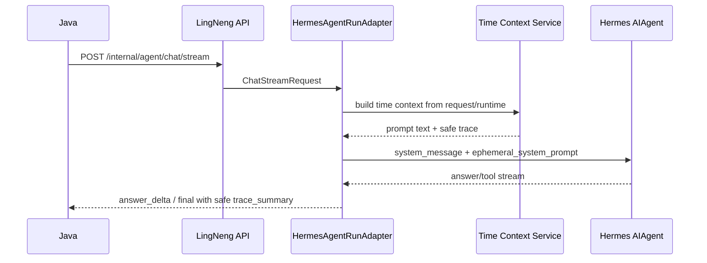

# Phase 11 Time Context And Prompt Hardening Spec

## Status

Drafted on `dev` after Phase 10 completed agent-native employee handoff.

This phase implements the next item in the business capability migration:

```text
deterministic time context + trusted/untrusted prompt sections + prompt regressions
```

It does not add external providers or move work from Phase 12, Phase 13, Phase
14, or Phase 15.

## Required Context Reloaded

Reloaded before writing this spec:

- `LINGNENG_MIGRATION_CONTEXT.md`
- `docs/lingneng-migration/specs/2026-06-06-lingneng-hermes-runtime-design.md`
- `docs/lingneng-migration/plans/2026-06-06-lingneng-hermes-runtime-implementation-plan.md`
- `docs/lingneng-migration/specs/2026-06-11-lingneng-business-capability-hermes-migration-spec.md`
- `docs/lingneng-migration/specs/2026-06-11-phase-9-hermes-native-skill-catalog-spec.md`
- `docs/lingneng-migration/specs/2026-06-11-phase-10-agent-native-employee-handoff-spec.md`

Current Hermes-side modules inspected:

- `lingneng/config/settings.py`
- `lingneng/schemas/chat_request.py`
- `lingneng/runtime/hermes_adapter.py`
- `lingneng/skills/loader.py`
- `lingneng/skills/models.py`
- `lingneng/tools/attachments.py`
- `tests/lingneng/config/test_settings.py`
- `tests/lingneng/runtime/test_hermes_adapter_config.py`
- `tests/lingneng/skills/test_skill_loader.py`

LingNengAI reference modules inspected:

- `/Users/rotas/Documents/work/hailun/LingNengAI/app/domain/time_context/models.py`
- `/Users/rotas/Documents/work/hailun/LingNengAI/app/domain/time_context/service.py`
- `/Users/rotas/Documents/work/hailun/LingNengAI/app/domain/time_context/repository.py`
- `/Users/rotas/Documents/work/hailun/LingNengAI/app/domain/time_context/scope.py`
- `/Users/rotas/Documents/work/hailun/LingNengAI/app/domain/time_context/festival_calendar.yaml`
- `/Users/rotas/Documents/work/hailun/LingNengAI/app/domain/prompt/compiler.py`
- `/Users/rotas/Documents/work/hailun/LingNengAI/app/domain/prompt/sections.py`
- `/Users/rotas/Documents/work/hailun/LingNengAI/app/domain/prompt/builders/business_agent.py`

## Current Baseline

Already implemented:

- `ChatStreamRequest.runtime_context.timezone` defaults to `Asia/Shanghai`.
- `ChatStreamRequest.runtime_context.region` defaults to `CN`.
- Skill prompt context is built by `LingNengSkillLoader` and is bounded by
  `skill_prompt_max_chars`.
- Handoff guidance is represented as an infrastructure skill fragment.
- Attachment prompt context is request-scoped and added through
  `ephemeral_system_prompt`.
- Minimal RAG guidance is added through `ephemeral_system_prompt`.
- Java `history` is accepted but not injected into Hermes conversation context.

Current gaps:

- No deterministic current date/time or festival context is injected.
- No Hermes-side LingNeng time/festival models exist.
- Prompt sections do not consistently label trusted, request-scoped untrusted,
  and tool-derived public context.
- Runtime context input values are not represented in prompt after validation.
- Prompt regression tests do not prove section ordering, trust labels, or time
  context safety.
- Observability/final trace does not include time context scope.

## Goal

Make LingNeng-Hermes answer time-sensitive business requests without a live
dependency and without copying the old prompt compiler:

1. Build deterministic time context from the current request, runtime timezone,
   region, employee type, and query text.
2. Add a static, repository-owned festival calendar for the initial `CN`
   business use case.
3. Inject bounded time context into the current request's prompt.
4. Formalize prompt trust boundaries:
   - trusted runtime context
   - trusted repository skill context
   - request-scoped untrusted context
   - tool-derived public observations
5. Keep Java `history`, raw attachment content, old prompt compiler internals,
   secrets, local paths, and raw provider payloads out of prompt and SSE public
   output.
6. Add prompt regression fixtures that are deterministic under frozen time.

## Scope

Phase 11 includes:

1. Add a `lingneng/context/` package for deterministic prompt context helpers.
2. Add time context Pydantic models.
3. Add a static CN festival calendar YAML owned by this repository.
4. Add a time context service with injectable `now_provider` for tests.
5. Support `today` and `upcoming_30_days` scopes.
6. Support solar date events and explicit dated events.
7. Support `solar_nth_weekday` events for common western/family festivals.
8. Avoid a new lunar calculation dependency in this phase.
9. Normalize invalid timezone/region values to safe defaults.
10. Inject time context into the ephemeral prompt as trusted runtime context.
11. Label attachment context as request-scoped untrusted context.
12. Label RAG guidance as tool-derived public observation guidance.
13. Add trace metadata for time context scope and event count in final output.
14. Add tests for settings, time models, calendar loading, time service,
    prompt assembly, prompt truncation/ordering, and old-path/import leakage.

## Non-Goals

Phase 11 does not:

- Modify Java code or require Java to send new fields.
- Change the Java-compatible `/internal/agent/chat/stream` endpoint.
- Add a live holiday API, search API, calendar service, Redis, Milvus, MinIO, or
  old LingNengAI runtime call.
- Add `lunar_python` or another new date dependency.
- Migrate full RAG query hardening.
- Migrate RAG training or ingestion.
- Wire real document/image/chart/search providers.
- Implement attachment parsing providers beyond existing safe prompt injection.
- Add a separate prompt compiler copied from LingNengAI.
- Inject Java `history` into prompt context.
- Change SessionDB session key policy.
- Re-run employee handoff or routing.
- Add deployment or CI/CD changes.

## Accepted Decisions

1. **Time context is request-scoped and trusted after validation.** It is built
   from runtime config, `ChatStreamRequest.runtime_context`, current wall clock,
   employee type, query text, and repository-owned calendar data. The resulting
   prompt section is trusted, but it is not stored as long-lived session memory.
2. **Use ephemeral prompt for time context.** Time changes every request. It
   belongs beside attachment and RAG guidance in `ephemeral_system_prompt`,
   while skill context remains in the normal system message.
3. **No new lunar dependency.** The existing project has PyYAML and zoneinfo
   available, but not `lunar_python`. Phase 11 supports explicit dated events
   for lunar-derived festivals rather than adding a new dependency.
4. **CN is the only supported region initially.** Unknown or blank regions
   normalize to `CN` and are reported through safe warnings.
5. **Invalid timezones degrade to Asia/Shanghai.** The prompt and trace must not
   expose tracebacks or local system timezone internals.
6. **Prompt labels are part of the contract.** Tests should assert stable
   section headings so later phases can place provider output without mixing
   trust levels.
7. **Existing Java system prompt remains first.** The Java-provided system
   prompt is still accepted for compatibility. Hermes-added context must be
   clearly labeled and must not trust Java `skill.inline`, `history`, or raw
   attachment text.
8. **Tool-derived context is public and bounded.** RAG/search/artifact summaries
   in later phases will go under tool-derived public observation sections. Phase
   11 only renames minimal RAG guidance and keeps it bounded.
9. **Observability is sanitized.** Final trace can include `scope`,
   `event_count`, `timezone`, and `region`, but not full prompt text or raw
   request payloads.

## User Confirmations Before Phase 11 Plan

No additional user confirmation is required before writing the Phase 11 plan if
the following assumptions remain accepted:

- Only `CN` region support is required in Phase 11.
- Phase 11 may use static repository calendar data and explicit dated entries
  instead of a live provider or new lunar dependency.
- Time context is injected into the current request prompt but not persisted as
  long-term session memory.
- Prompt hardening is limited to LingNeng-added prompt sections; Java system
  prompt compatibility remains unchanged.

If a live holiday provider, complete lunar calendar engine, or multi-region
calendar is required immediately, this spec must be revised before planning.

## Data Contracts

### Time Context Scope

```text
today
upcoming_30_days
```

Rules:

- Queries mentioning `今天`, `今日`, or `当天` use `today`.
- Queries mentioning `最近`, `接下来`, `未来`, `近期`, `本月`, `下个月`,
  `节日`, `营销节点`, `活动节点`, or similar planning language use
  `upcoming_30_days`.
- Default is `today`.

### Calendar Event Config

Repository YAML event fields:

```text
id: str
name: str
category: public_holiday | traditional_festival | marketing_event |
          internet_culture | western_festival
calendar: solar | solar_nth_weekday | explicit_date
month: int | null
day: int | null
nth: int | null
weekday: int | null  # ISO 1-7
dates: list[str]     # ISO YYYY-MM-DD for explicit_date
marketing_hint: str
marketing_tier: S | A | B | C | D
heat_score: int      # 1-5
business_type: str
marketing_focus: str
suitable_employee_types: list[EmployeeType]
```

Rules:

- `solar` requires `month` and `day`.
- `solar_nth_weekday` requires `month`, `nth`, and `weekday`.
- `explicit_date` requires non-empty `dates`.
- Invalid employee types or invalid dates fail calendar loading in tests.
- Public prompt output never includes raw YAML paths.

### Time Context Event

Prompt-facing event fields:

```text
id: str
name: str
category: str
date: str
days_until: int
marketing_hint: str
marketing_tier: str
heat_score: int
business_type: str
marketing_focus: str
focus_level: primary | secondary | background
priority_reason: str
```

Rules:

- Events unsuitable for the current employee are filtered out.
- Explicit query mentions boost priority.
- At most two `primary` events are allowed.
- Events are sorted by priority, value tier, heat, days until, name, and id.
- Prompt output should include only the first bounded set of events.

### Current Time Context

```text
current_date: YYYY-MM-DD
current_datetime: ISO datetime with timezone offset
timezone: str
region: str
weekday_cn: str
scope: TimeContextScope
events: list[TimeContextEvent]
warnings: list[str]
```

Safe trace summary:

```json
{
  "time_context": {
    "scope": "upcoming_30_days",
    "event_count": 3,
    "timezone": "Asia/Shanghai",
    "region": "CN"
  }
}
```

### Prompt Sections

Target section order for effective prompt:

1. Java system prompt content.
2. `## LingNeng Skill Context`
3. `## LingNeng Trusted Runtime Context`
4. `## LingNeng Request-Scoped Untrusted Context` when attachments exist or
   request runtime warnings exist.
5. `## LingNeng Tool-Derived Public Guidance`

Section rules:

- Trusted runtime context contains validated time context only.
- Skill context remains bounded and keeps handoff/tool guidance.
- Request-scoped untrusted context may include attachment summaries and safe
  warnings. It must not include Java `history` or `skill.inline`.
- Tool-derived public guidance contains RAG guidance in Phase 11 and is the
  future home for bounded RAG/search/artifact observations.

## Prompt Behavior

The time context prompt should tell the agent:

1. Treat `current_date`, `weekday`, `timezone`, and `region` as deterministic
   runtime facts for this turn.
2. Use festival events as marketing/operation context when relevant.
3. Do not claim events outside the listed context unless using a configured
   tool in later phases.
4. Do not expose internal event priority rules or hidden scoring.
5. If no event is listed, use the current date/time only.

The prompt must stay bounded by new context-specific settings and the existing
skill prompt limit. It must not include raw YAML, local paths, old `app.*`
module names, tracebacks, API keys, tokens, or full request payloads.

## Event Flow



## Module Boundaries

Expected additions:

- `lingneng/context/__init__.py`
- `lingneng/context/time.py`
- `lingneng/context/prompt.py`
- `lingneng/context/festival_calendar.yaml`
- `tests/lingneng/context/test_time_context.py`
- `tests/lingneng/context/test_prompt_context.py`

Expected modifications:

- `lingneng/config/settings.py`
  - add non-secret time/prompt bounds.
- `lingneng/runtime/hermes_adapter.py`
  - build time context once per request.
  - compose trusted/untrusted/tool-derived ephemeral prompt sections.
  - include time trace in final trace summary.
- `tests/lingneng/config/test_settings.py`
  - add defaults and env overrides.
- `tests/lingneng/runtime/test_hermes_adapter_config.py`
  - add prompt order, boundedness, frozen-time, and history-exclusion tests.
- `tests/lingneng/skills/test_skill_loader.py`
  - ensure skill prompt still keeps handoff guidance after prompt hardening.

Avoid changes to:

- `run_agent.py`
- `model_tools.py`
- unrelated Hermes toolsets
- gateway platform adapters
- old `/Users/rotas/Documents/work/hailun/LingNengAI` files

## Configuration

Add settings:

```text
LINGNENG_TIME_CONTEXT_ENABLED
LINGNENG_TIME_CONTEXT_DEFAULT_TIMEZONE
LINGNENG_TIME_CONTEXT_DEFAULT_REGION
LINGNENG_TIME_CONTEXT_MAX_EVENTS
LINGNENG_TIME_CONTEXT_PROMPT_MAX_CHARS
LINGNENG_PROMPT_SECTION_MAX_CHARS
```

Defaults:

```text
LINGNENG_TIME_CONTEXT_ENABLED=true
LINGNENG_TIME_CONTEXT_DEFAULT_TIMEZONE=Asia/Shanghai
LINGNENG_TIME_CONTEXT_DEFAULT_REGION=CN
LINGNENG_TIME_CONTEXT_MAX_EVENTS=5
LINGNENG_TIME_CONTEXT_PROMPT_MAX_CHARS=3000
LINGNENG_PROMPT_SECTION_MAX_CHARS=8000
```

These are non-secret settings. No `.env` secret metadata is needed.

## Testing Strategy

### Settings Tests

Extend:

- `tests/lingneng/config/test_settings.py`

Assertions:

- Defaults are safe and enabled.
- Env overrides parse booleans, timezone, region, max events, and prompt bounds.
- Ready summary does not expose secrets and can include time-context enabled
  status without raw prompt text.

### Time Context Tests

Add:

- `tests/lingneng/context/test_time_context.py`

Assertions:

- Frozen `2026-06-11T10:30:00+08:00` yields current date, weekday, timezone,
  and region deterministically.
- Invalid timezone falls back to `Asia/Shanghai` with a safe warning.
- Unknown region falls back to `CN` with a safe warning.
- Query scope detection returns `today` and `upcoming_30_days`.
- Solar and `solar_nth_weekday` events match the correct date window.
- Explicit dated events can represent lunar-derived business events without a
  lunar dependency.
- Employee suitability filters unrelated events.
- Query mention boosts matching event priority.
- Prompt text is bounded and excludes raw paths, `app.*`, secrets, and
  tracebacks.

### Prompt Context Tests

Add:

- `tests/lingneng/context/test_prompt_context.py`

Assertions:

- Trusted runtime, request-scoped untrusted, and tool-derived public headings are
  stable.
- Empty sections are omitted.
- Section text is bounded independently.
- Attachment context appears only under request-scoped untrusted context.
- RAG guidance appears under tool-derived public guidance.

### Adapter Prompt Tests

Extend:

- `tests/lingneng/runtime/test_hermes_adapter_config.py`

Assertions:

- Effective prompt order is Java system prompt, skill context, trusted runtime
  context, untrusted attachment context, tool-derived public guidance.
- Java `history` and `skill.inline` remain excluded.
- Runtime time context is current-request only and changes when the frozen clock
  changes.
- Final trace summary includes sanitized time context scope and event count.
- Disabling time context removes only the time section, not skill/RAG/attachment
  guidance.

### Regression/Safety Tests

Run:

```bash
uv run --extra dev python -m pytest tests/lingneng -q
uv run --extra dev python -m ruff check lingneng tests/lingneng
rg -n "from app\\.|import app\\.|/Users/rotas/Documents/work/hailun/LingNengAI|prompt_assembly_service|entry_decision|light_answer|history_policy" lingneng tests/lingneng
```

The `rg` command should have no runtime-code output. Test assertions that prove
old names are absent are acceptable after inspection.

## Acceptance Criteria

Phase 11 is complete when:

1. Time context models and service exist under `lingneng/context/`.
2. Time context uses deterministic, testable clock injection.
3. Timezone and region inputs degrade safely to defaults.
4. Static CN calendar data is loaded from this repository, not from old
   LingNengAI.
5. No new lunar/live-provider dependency is added.
6. Time context supports `today` and `upcoming_30_days` scopes.
7. Prompt sections clearly distinguish trusted runtime context, skill context,
   request-scoped untrusted context, and tool-derived public guidance.
8. Time context is injected into the current request prompt and is not merged
   with Java `history`.
9. Attachment prompt context appears only under request-scoped untrusted
   headings.
10. RAG guidance appears under tool-derived public guidance.
11. Final trace summary includes safe time context metadata.
12. Prompt regression tests prove section ordering, boundedness, and old
    LingNengAI path/name exclusion.
13. No old `app.*` LingNengAI runtime imports are introduced.
14. The full LingNeng test suite passes:

```bash
uv run --extra dev python -m pytest tests/lingneng -q
```

15. Lint passes:

```bash
uv run --extra dev python -m ruff check lingneng tests/lingneng
```

## Rollback Notes

This phase is isolated behind:

- time context service construction in `HermesAgentRunAdapter`
- prompt section composition helpers under `lingneng/context/`
- new non-secret time context settings
- bundled `lingneng/context/festival_calendar.yaml`

Rollback can disable `LINGNENG_TIME_CONTEXT_ENABLED` or remove the time context
section from ephemeral prompt composition. Phase 9 skill tools and Phase 10
handoff behavior should continue to work without the time context section.

## Open Future Work

Not part of Phase 11:

- Full lunar calendar calculation dependency.
- Multi-region calendar packs beyond `CN`.
- Live holiday/calendar provider.
- Tool-derived RAG/search/artifact observation sections with real provider
  payloads.
- Attachment provider implementation.
- Prompt A/B evaluation against old LingNengAI outputs.

## Spec Self-Review

- Placeholder scan: no placeholder tokens or unfinished sections remain.
- Consistency check: time context is request-scoped, trusted after validation,
  injected through ephemeral prompt, and does not change session key or Java
  contract.
- Scope check: Phase 11 is limited to deterministic time context, prompt trust
  labels, safe trace metadata, and prompt regressions.
- Ambiguity check: lunar/live provider behavior is explicitly out of scope; CN
  static calendar and explicit dated events are the Phase 11 boundary.
