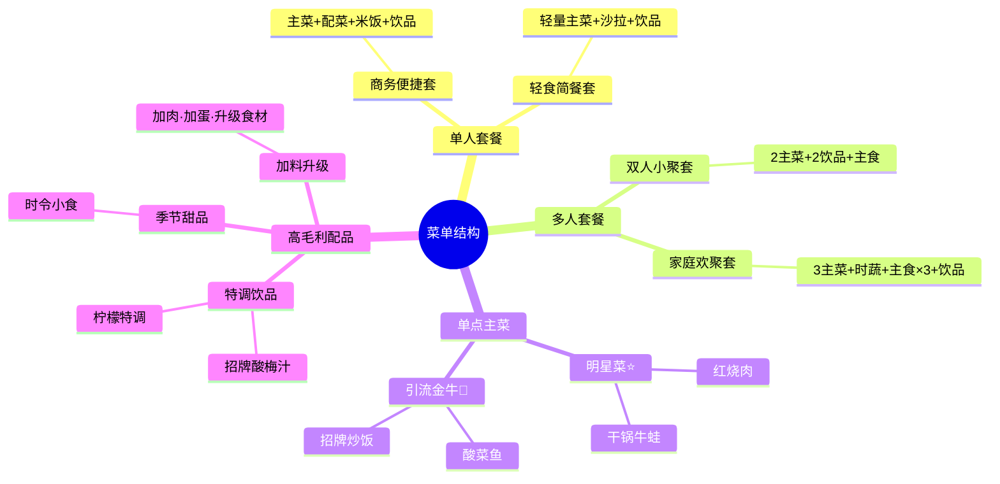
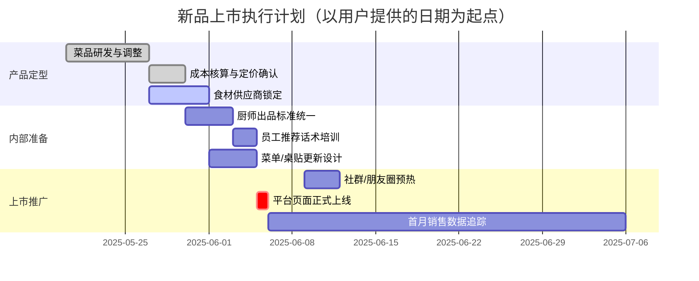

# 图表生成模板库

> 使用时：将示例数据替换为用户提供的实际数据。所有文字标签均用中文。

---

## 1. 波士顿矩阵散点图（Python）

适用场景：SKU 健康度诊断，≥4 道菜时主动生成。

```python
import matplotlib.pyplot as plt
import matplotlib.patches as patches
import numpy as np

plt.rcParams['font.sans-serif'] = ['SimHei', 'Arial Unicode MS']
plt.rcParams['axes.unicode_minus'] = False

# ====== 替换为用户实际数据 ======
dishes = ['红烧肉', '酸菜鱼', '干锅牛蛙', '清炒时蔬', '招牌炒饭', '特色豆腐']
gross_margins = [67.6, 38.0, 71.0, 28.0, 55.0, 72.0]   # 毛利率(%)
daily_sales   = [10.7, 22.0, 2.1, 1.2, 15.3, 3.5]       # 日均销量(份)
# ================================

avg_margin = np.mean(gross_margins)
avg_sales  = np.mean(daily_sales)

fig, ax = plt.subplots(figsize=(11, 8))

# 四象限背景色
ax.fill_between([avg_sales, max(daily_sales)*1.3], avg_margin, max(gross_margins)*1.1,
                alpha=0.08, color='gold')        # 明星
ax.fill_between([0, avg_sales], avg_margin, max(gross_margins)*1.1,
                alpha=0.08, color='orange')      # 问题
ax.fill_between([avg_sales, max(daily_sales)*1.3], 0, avg_margin,
                alpha=0.08, color='green')       # 金牛
ax.fill_between([0, avg_sales], 0, avg_margin,
                alpha=0.08, color='red')         # 瘦狗

# 分界线
ax.axhline(y=avg_margin, color='gray', linestyle='--', alpha=0.6, linewidth=1)
ax.axvline(x=avg_sales,  color='gray', linestyle='--', alpha=0.6, linewidth=1)

# 象限标签
margin_range = max(gross_margins) - min(gross_margins)
sales_range  = max(daily_sales) - min(daily_sales)
ax.text(avg_sales + sales_range*0.05, max(gross_margins) - margin_range*0.08,
        '⭐ 明星菜\n（高销高利）', fontsize=11, color='#B8860B', fontweight='bold')
ax.text(min(daily_sales), max(gross_margins) - margin_range*0.08,
        '❓ 问题菜\n（低销高利）', fontsize=11, color='#FF8C00', fontweight='bold')
ax.text(avg_sales + sales_range*0.05, min(gross_margins) + margin_range*0.02,
        '🐄 金牛菜\n（高销低利）', fontsize=11, color='#228B22', fontweight='bold')
ax.text(min(daily_sales), min(gross_margins) + margin_range*0.02,
        '🐕 瘦狗菜\n（低销低利）', fontsize=11, color='#CC0000', fontweight='bold')

# 散点（大小与毛利率成正比）
sizes = [m * 4 for m in gross_margins]
colors = ['gold' if (m >= avg_margin and s >= avg_sales) else
          'orange' if (m >= avg_margin and s < avg_sales) else
          'green' if (m < avg_margin and s >= avg_sales) else
          'red' for m, s in zip(gross_margins, daily_sales)]

scatter = ax.scatter(daily_sales, gross_margins, s=sizes, c=colors, alpha=0.85,
                     edgecolors='white', linewidth=1.5, zorder=5)

# 标注菜名
for i, name in enumerate(dishes):
    ax.annotate(name, (daily_sales[i], gross_margins[i]),
                textcoords='offset points', xytext=(10, 5),
                fontsize=9.5, fontweight='bold',
                bbox=dict(boxstyle='round,pad=0.2', facecolor='white', alpha=0.7))

# 均值标注
ax.axhline(y=avg_margin, color='gray', linestyle='--', alpha=0.4)
ax.text(max(daily_sales)*1.25, avg_margin + 0.5, f'均值{avg_margin:.1f}%',
        fontsize=8, color='gray')

ax.set_xlabel('日均销量（份）', fontsize=12)
ax.set_ylabel('菜品毛利率（%）', fontsize=12)
ax.set_title('菜单健康度矩阵（波士顿矩阵）', fontsize=14, fontweight='bold', pad=15)
ax.set_xlim(0, max(daily_sales) * 1.3)
ax.set_ylim(0, max(gross_margins) * 1.15)

plt.tight_layout()
plt.savefig('菜单健康度矩阵.png', dpi=150, bbox_inches='tight')
plt.show()
print("图表已保存至：菜单健康度矩阵.png")
```

---

## 2. 帕累托分布图（Python）

适用场景：展示"哪20%的菜品贡献了80%的营收"，菜单精简决策时使用。

```python
import matplotlib.pyplot as plt
import numpy as np

plt.rcParams['font.sans-serif'] = ['SimHei', 'Arial Unicode MS']
plt.rcParams['axes.unicode_minus'] = False

# ====== 替换为用户实际数据 ======
dishes   = ['酸菜鱼', '红烧肉', '招牌炒饭', '干锅牛蛙', '特色豆腐', '清炒时蔬']
revenues = [5984, 4590, 4131, 1344, 792, 168]   # 月营收(元)
# ================================

# 按营收降序排列
sorted_pairs = sorted(zip(revenues, dishes), reverse=True)
revenues_sorted, dishes_sorted = zip(*sorted_pairs)

cumsum = np.cumsum(revenues_sorted)
total  = sum(revenues_sorted)
cumulative_pct = cumsum / total * 100

fig, ax1 = plt.subplots(figsize=(10, 6))
ax2 = ax1.twinx()

bars = ax1.bar(dishes_sorted, revenues_sorted, color='steelblue', alpha=0.75, label='月营收(元)')
ax2.plot(dishes_sorted, cumulative_pct, 'r-o', linewidth=2, markersize=6, label='累计占比%')
ax2.axhline(y=80, color='orange', linestyle='--', alpha=0.7, linewidth=1)
ax2.text(len(dishes)-0.5, 81, '80%线', color='orange', fontsize=9)

ax1.set_xlabel('菜品', fontsize=11)
ax1.set_ylabel('月营收（元）', fontsize=11, color='steelblue')
ax2.set_ylabel('累计营收占比（%）', fontsize=11, color='red')
ax2.set_ylim(0, 115)

# 在柱子上标注金额
for bar, rev in zip(bars, revenues_sorted):
    ax1.text(bar.get_x() + bar.get_width()/2, bar.get_height() + total*0.005,
             f'¥{rev:,}', ha='center', va='bottom', fontsize=9)

plt.title('菜品营收帕累托分析', fontsize=13, fontweight='bold', pad=12)
ax1.legend(loc='upper left')
ax2.legend(loc='upper right')
plt.tight_layout()
plt.savefig('营收帕累托.png', dpi=150, bbox_inches='tight')
plt.show()
```

---

## 3. 套餐结构思维导图（Mermaid）

适用场景：梳理套餐体系或整体菜单结构，无需运行代码，直接渲染。



---

## 4. 新品上市甘特图（Mermaid）

适用场景：制定新品上市执行计划。将日期替换为实际时间节点。



---

## 5. 菜品定价区间对比图（Python）

适用场景：展示多道菜品的成本/当前定价/竞品区间对比。

```python
import matplotlib.pyplot as plt
import numpy as np

plt.rcParams['font.sans-serif'] = ['SimHei', 'Arial Unicode MS']
plt.rcParams['axes.unicode_minus'] = False

# ====== 替换为用户实际数据 ======
dishes         = ['红烧肉', '酸菜鱼', '干锅牛蛙']
cost           = [22, 38, 56]          # 食材成本
current_price  = [68, 88, 128]         # 当前定价
market_low     = [58, 78, 108]         # 竞品区间下限
market_high    = [98, 128, 188]        # 竞品区间上限
# ================================

x = np.arange(len(dishes))
fig, ax = plt.subplots(figsize=(10, 6))

# 竞品区间（灰色区域）
for i, (low, high) in enumerate(zip(market_low, market_high)):
    ax.fill_between([i-0.35, i+0.35], low, high, alpha=0.15, color='blue')
    ax.text(i+0.4, (low+high)/2, f'市场\n{low}-{high}元', fontsize=8, color='blue', va='center')

# 成本底线
ax.scatter(x, cost, marker='_', s=500, color='red', linewidths=2, zorder=5, label='食材成本')
# 当前定价
ax.scatter(x, current_price, marker='D', s=100, color='steelblue', zorder=6, label='当前定价')

# 标注当前价格
for i, (cp, c) in enumerate(zip(current_price, cost)):
    margin = (cp - c) / cp * 100
    ax.annotate(f'¥{cp}\n毛利{margin:.0f}%', (i, cp),
                textcoords='offset points', xytext=(12, 0), fontsize=8.5,
                color='steelblue', fontweight='bold')

ax.set_xticks(x)
ax.set_xticklabels(dishes, fontsize=11)
ax.set_ylabel('价格（元）', fontsize=11)
ax.set_title('菜品定价区间对比分析', fontsize=13, fontweight='bold')
ax.legend(fontsize=10)
ax.grid(axis='y', alpha=0.3)
plt.tight_layout()
plt.savefig('定价区间对比.png', dpi=150, bbox_inches='tight')
plt.show()
```

---

## 图表使用说明

1. **Mermaid 图表**（思维导图/甘特图）：直接输出代码块，Claude Code 和大多数 Markdown 渲染器会自动渲染
2. **Python 图表**：输出代码块，用户复制到本地执行，或在支持代码执行的环境中直接运行
3. **生成时机**：不要等用户要求，当分析场景匹配时主动提供
4. **数据替换**：务必用用户实际数据替换示例数据中的内容
