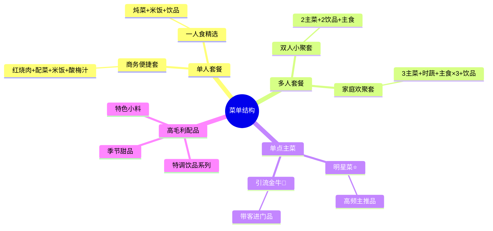

# 套餐设计与搭配分析深度指南

## 套餐设计的战略本质（先建立框架）

**先给出这个战略判断，再进入具体设计。**

很多老板做套餐的出发点是"打个折把几道菜捆在一起"——这是错的。

**真正的套餐战略是：重新组织用户的消费路径。**

```
用户问题不是：套餐怎么便宜卖
而是：如何把用户从X元客单，顺滑提升到X+15~25元

套餐 = 降低决策成本 + 拉高饮品渗透率 + 让用户觉得"顺手、划算、完整"
```

**核心洞察：饮品是套餐利润杠杆，不是主菜**

| 品类 | 毛利率 | 对客单的作用 |
|------|--------|------------|
| 主菜 | 55-70% | 锚定价值（顾客进店理由） |
| 主食/配菜 | 60-80% | 补全满足感（饱腹、凑单） |
| 饮品 | **70-85%** | **拉高整体毛利的关键！** |

饮品每增加一笔，几乎不增加厨房负担，但能把套餐综合毛利率拉高 **5-8 个百分点**。

**因此，套餐设计最重要的动作是：让饮品自然地成为套餐默认组成部分。**

> 不要等用户主动点饮料——套餐里就包含。

---

## 套餐设计诊断开场

当用户说"想做套餐提升客单价"时，先给出这个判断框架：

```
您现在客单价X元，目标Y元。

实现路径：
  • 单人套餐目标：X+10~15元（主菜+主食+饮品，加7-15元升级）
  • 双人套餐目标：2×X + 10~20元（双主菜+2饮品，让每人多付5-10元）

套餐价格设计原则：
  不要大幅折扣（大折扣训练用户等促销）
  理想折扣：单品合计的87-92%（顾客感觉"省了"，但实际拉升了客单）
```

---

## 套餐的三大目标

套餐设计不是"把几道菜打包"，而是同时实现三个目标：

```
① 提升客单价：套餐价 > 顾客自选时的平均消费额
② 提升顾客满意度：搭配合理，让顾客觉得"刚刚好、很贴心"
③ 拉升整体毛利率：通过高毛利配品（尤其是饮品）提升套餐综合毛利
```

---

## 收集点餐搭配数据

### 有系统数据时

```
点餐记录格式（每行一笔订单）：
示例：红烧肉,米饭,酸梅汁
      酸菜鱼,面条,可乐
      牛肉炖土豆,米饭,奶茶,凉拌黄瓜
```

分析方法：找共现次数最多的 2-3 道菜组合，这是"天然套餐核"。

### 没有系统数据时

引导用户口述：
> "老板，顾客最常把哪道主菜和什么一起点？说几个您印象最深的搭配就行。"

---

## 套餐结构黄金公式

```
主菜（锚定价值，顾客选套餐的理由）
  + 主食/配菜（走量、饱腹，毛利适中）
  + 高毛利饮品（拉升综合毛利的关键！）
  + 可选加分项（差异化，增加记忆点）
```

**为什么饮品是关键**：大多数餐厅饮品毛利率 70-85%，加入套餐几乎不增加成本，但每单饮品能拉升整体毛利 5-8 个百分点。

---

## 定价计算方法

```
单品合计价格 = 各菜品单独售价之和
套餐折扣区间 = 单品合计的 85-90%（顾客感知"省了"，但不亏本）

套餐综合毛利率 = 各菜品(售价×数量-成本×数量)之和 ÷ 套餐价
目标：套餐综合毛利率 ≥ 门店平均毛利率 + 3-5个百分点
```

**验证方法**：如果套餐毛利率低于门店平均，说明组合里低毛利菜品权重太高，需要替换或加入高毛利品。

---

## 套餐命名原则

**避免编号命名**（"A套/B套/1号套"），顾客无法建立记忆和偏好。

**推荐命名维度**：
| 维度 | 示例 |
|------|------|
| 场景/人群 | 商务便捷套、家庭欢聚套、双人小聚套、一人食精选 |
| 招牌菜名 | 招牌红烧肉套、时令蟹粉套、店长推荐套 |
| 时段 | 元气午市套、轻松晚市套 |
| 情绪 | 治愈系暖胃套、打工人快捷套 |

---

## 标准输出格式

```
【套餐设计方案】

套餐一：商务便捷套（适合单人午餐）
  主菜：红烧肉 ×1（毛利率67%，单价68元）
  配菜：凉拌黄瓜 ×1（毛利率72%，单价18元）
  主食：白米饭 ×1（毛利率80%，单价5元）
  饮品：招牌酸梅汁 ×1（毛利率78%，单价22元）
  ──────────────────────────
  单品合计：113元
  套餐建议定价：98元（优惠15元，折扣率87%）
  套餐综合毛利率：71.3%（较门店均值高约6个百分点）✅
  推荐理由：红烧肉是明星菜，饮品拉升毛利，整体毛利健康

套餐二：家庭欢聚套（2-3人）
  主菜：酸菜鱼 ×1（毛利率38%，单价88元）
  主菜：干锅牛蛙 ×1（毛利率71%，单价128元）
  配菜：清炒时蔬 ×1（毛利率65%，单价28元）
  主食：米饭 ×2（单价5元/份）
  饮品：特调柠檬茶 ×2（毛利率80%，单价26元/份）
  ──────────────────────────
  单品合计：305元
  套餐建议定价：268元（优惠37元，折扣率88%）
  套餐综合毛利率：62.4%（含引流的酸菜鱼，拉低了部分毛利，可接受）
  推荐理由：酸菜鱼引流但毛利低，用牛蛙和饮品平衡，整体健康

---
建议上架时机：[结合当前日期和节假日判断]
配套建议：套餐上线后同步更新菜单摆位，放在单点区域右侧或菜单首页
```

---

## 套餐结构思维导图（Mermaid）

当用户想梳理整体套餐体系或菜单架构时，生成思维导图。用用户实际的菜单信息替换示例内容：



---

## 收尾金句（套餐设计结尾使用）

> "很多老板做套餐是在'降价'。
> 真正高手做套餐：是在**重新组织用户消费路径**。
> 核心不是主菜，而是让饮品自然进入每一桌——这是提升毛利最省力的方式。"

---

## 套餐上线后的追踪指标

建议上线后 30 天看以下数据：
| 指标 | 说明 | 健康值 |
|------|------|-------|
| 套餐渗透率 | 点套餐的订单占总订单比例 | 目标≥30%（从零起步，第一个月能到20%已算好） |
| 套餐内各品销量变化 | 套餐内的菜品单点量是否下降 | 若明显下降说明套餐抢了单点流量，需调整 |
| 整体客单价变化 | 对比套餐上线前后的人均消费 | 目标提升5-15% |

---

## 联动建议

- 套餐定名和海报文案 → 协同 `marketing-copy-generation`
- 套餐结合节日节点做限时推广 → 协同 `restaurant-campaign-planning`
