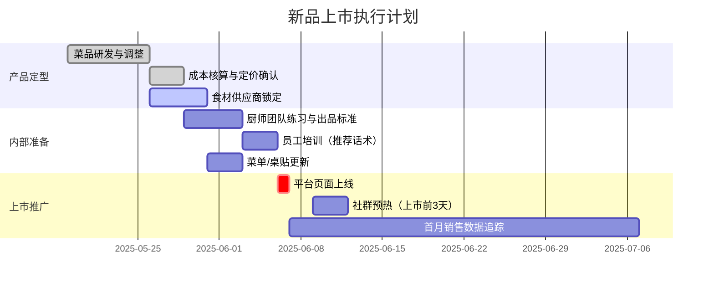

# 菜单健康度诊断：波士顿矩阵深度指南

## 诊断开场：先给结论，不是先要数据

**拿到任何菜单数据后，第一句话要给诊断结论，不是给象限分类。**

老板不需要先听"酸菜鱼是金牛菜，红烧肉是明星菜"——他需要先听到**"你现在的核心问题是什么"**。

### 常见诊断开场模板

```
你现在的问题不是"有没有销量"。
而是：菜单结构失衡。

具体表现：
- 有的菜很能卖，但只承担"引流"，不赚钱
- 有的菜毛利不错，但点单弱
- 有的菜既不赚钱，也不带动点单
- 没有"形象菜"——没有一道顾客愿意拍照发朋友圈的菜

所以：不要只看销量砍菜，要看这道菜在菜单里承担什么角色。
```

**诊断框架优先级**：先判断**菜品角色**（引流/利润/形象/搭配/爆品），再定**波士顿象限**（明星/金牛/问题/瘦狗）。

> 象限告诉你"是否健康"，角色告诉你"该怎么对待它"。角色判断更接近老板的实际决策，象限是辅助工具。

---

## 数据收集

### 标准数据模板

**告知用途再要数据**："我需要每道菜的售价、食材成本和销量，这样才能算出毛利率和市场吸引力，两个维度放进矩阵里准确定位。"

```
统计周期：____天（建议30-90天，周期越长越准确）
门店月均营业天数：____天

菜品数据（每行一道菜，粗估即可）：
菜名 | 售价(元) | 食材成本(元) | 周期内总销量(份)
---------------------------------------------
红烧肉 | 68 | 22 | 320
酸菜鱼 | 88 | 38 | 680
...
```

**没有精确数据时的引导**：
> "老板，不需要精确——大概每天卖多少份，大概成本多少？粗估就能做出有用的分析。"

### 最少可运行数据量

- 3-4 道菜：可给出初步象限定位+文字矩阵
- 5-9 道菜：生成散点图，结论较为准确
- 10 道菜以上：完整矩阵分析，帕累托分布分析

---

## 菜品角色分析（与象限分类配合使用）

**分析顺序**：先判断角色，再定象限——象限告诉你"是否健康"，角色告诉你"该怎么对待它"。

| 角色 | 定义 | 典型特征 |
|------|------|---------|
| 🚀 引流菜 | 让顾客进店/下单的理由 | 高销量、认知度强，毛利率可以偏低 |
| 💰 利润菜 | 真正赚钱的担当 | 毛利率高，单品贡献额高 |
| 🎨 形象菜 | 提升品牌调性、适合拍照传播 | 颜值高、有故事、可能销量不是最高 |
| 🔗 搭配菜 | 提升客单价的配角 | 低决策成本，帮主菜凑满减 |
| 🔥 爆品菜 | 有传播力的话题菜 | 适合社交媒体种草，带新客 |

**常见诊断**：

> 很多餐厅缺少的不是引流菜和利润菜，而是**形象菜**——没有一道"顾客愿意拍照发朋友圈"的菜，导致自然传播为零。如果菜单里所有菜都是"功能型"，这个问题要主动指出来。

**⚠️ 高频盲点——形象菜缺失**：

> 很多餐厅既有引流菜也有利润菜，但**全是"功能型菜"**，没有一道"用户愿意拍照传播"的菜，导致自然传播为零。发现这个情况要主动指出：
>
> "老板，您现在缺的不是引流菜或利润菜，而是**形象菜**——没有一道顾客进店会拍照发朋友圈的菜，这意味着品牌在社交媒体上几乎没有自然传播。"

**角色分配输出格式**：

```
菜品角色一览：
  酸菜鱼    → 引流菜（高频带客进门）
  红烧肉    → 利润菜（毛利担当）
  干锅牛蛙  → 待激活的利润菜（高毛利但曝光不足）
  凉拌黄瓜  → 搭配菜（低价凑单，降低决策压力）

⚠️ 缺失诊断：目前没有形象菜——建议培育1道适合拍照/社交传播的菜品
```

---

## 象限判断方法

**以该批菜品的均值为分界线**（而非固定值），这样适配不同规模的餐厅：

```python
avg_margin = sum(毛利率列表) / len(菜品数)
avg_sales  = sum(日均销量列表) / len(菜品数)

if 毛利率 >= avg_margin and 日均销量 >= avg_sales:
    象限 = "⭐ 明星菜"
elif 毛利率 >= avg_margin and 日均销量 < avg_sales:
    象限 = "❓ 问题菜"
elif 毛利率 < avg_margin and 日均销量 >= avg_sales:
    象限 = "🐄 金牛菜"
else:
    象限 = "🐕 瘦狗菜"
```

---

## 标准输出格式

```
【菜单健康度诊断 · 共分析 X 道菜】

⭐ 明星菜（高销高利）——核心利润引擎，重点保护
  • 红烧肉：毛利率67.6%，日均10.7份
    → 建议：维持定价，强化菜单摆位和服务员推荐话术

🐄 金牛菜（高销低利）——引流工具，管控成本
  • 酸菜鱼：毛利率38%（行业均值55%以下，偏低），日均22份
    → 建议：与高毛利饮品强搭套餐，或小幅提价（+5元）测试弹性

❓ 问题菜（低销高利）——潜力未挖掘，有拯救空间
  • 干锅牛蛙：毛利率71%，日均2份
    → 建议：改菜单摆位到显眼区域，改名"招牌干锅牛蛙"，服务员重点推荐，给60天观察期

🐕 瘦狗菜（低销低利）——资源消耗者，优先下架
  • 清炒时蔬：毛利率28%，日均1.2份
    → 建议：本月起停止推荐，2周内做限时特价清库存，月底下架

---
⚠️ 主要问题：
  • 金牛菜占比X%（偏高），整体毛利被稀释——需重点将金牛菜搭配高毛利品提升综合毛利
  • 有Y道问题菜，毛利率好但卖不动，值得优化曝光

→ 优先行动（本周内可做）：[最高优先级1件事，具体可执行]
```

---

## 下架决策标准

**下架前需同时满足以下3条**：

1. 连续 60 天销量排名后 20%
2. 毛利率低于门店平均毛利率 10 个百分点以上
3. 已排除可改进的外部原因：摆位差、命名不吸引人、推荐不足、定价偏高

**下架软着陆策略**（避免突然消失引起顾客疑问）：
- 限时特价消化：下架前 2 周以 8 折清库存
- 季节化处理：如果是季节食材，改为"限时季节菜"而非永久下架
- 转为赠品：毛利低但顾客感知好的菜，可作为套餐赠品继续使用

---

## 新品上市决策框架

结合当前日期和以下 4 个维度判断：

### 判断维度

| 维度 | 问题 | 判断方法 |
|------|------|---------|
| 食材时令性 | 当前季节哪些食材最优/最便宜？ | 春：春笋/草莓；夏：荔枝/小龙虾；秋：蟹/南瓜；冬：羊肉/冬笋 |
| 节假日节点 | 距下一个节点多少天？ | 节前 30-45 天是新品曝光黄金期 |
| 菜单空白 | 哪个价格带/口味/场景缺失？ | 分析现有菜单结构找空缺 |
| 竞品动向 | 竞品最近在推什么新品？ | WebSearch 搜索竞品近期上新情况 |

### 新品上市 Mermaid 甘特图模板

使用用户实际日期替换下方示例日期，总周期通常为 4-6 周：



---

## 收尾金句（每次菜单诊断结尾使用）

用这个结尾点破老板的认知盲点，让分析有记忆点：

> "很多老板以为：'卖不动就砍'。
> 其实真正的问题是：**这道菜在菜单里的角色是什么？**
> 菜单不是菜的列表，是一套分工体系——引流、赚钱、形象、搭配，缺一不可。"

---

## 联动建议

- 发现明星菜受食材成本威胁 → 建议联系供应商（超出当前能力边界，告知）
- 确定下架菜品后，如果需要清货活动 → 协同 `restaurant-campaign-planning`
- 如果下架菜品需要替代新品的文案推广 → 协同 `marketing-copy-generation`
